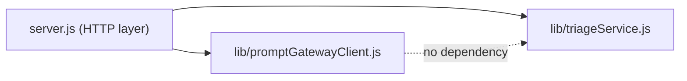

# Architecture Spine — Support Ticket Triage

## Design Paradigm

**Layered + adapter**, extending the prior demo app's own precedent rather
than introducing new vocabulary. `server.js` is a thin HTTP layer; every
external dependency (the triage LLM, PromptGateway) is isolated behind its
own adapter module under `lib/`. `server.js` orchestrates by calling
adapters in sequence — it holds no external-call logic itself.

## Invariants & Rules

### AD-1 — Layered + adapter structure

- **Binds:** all
- **Prevents:** a future story introducing a web framework, or external-call
  logic leaking into `server.js` instead of an adapter.
- **Rule:** `server.js` handles HTTP routing and orchestration only. Each
  external dependency gets exactly one adapter module under `lib/`; no
  adapter calls another adapter directly.



### AD-2 — PromptGateway integration boundary

- **Binds:** FR-4, FR-5, FR-6
- **Prevents:** adding an HTTP client npm dependency; conflating the
  screening call with the triage call in one module.
- **Rule:** `lib/promptGatewayClient.js` is the sole caller of
  PromptGateway (`POST /api/v1/validate`), using Node's native `fetch`
  (no new dependency). It returns a normalized `{decision, reason,
  categories_triggered}` shape where `decision` is one of `ALLOW` / `FLAG`
  / `BLOCK` / `UNREACHABLE` (AD-3) — a closed 4-value set, not the raw
  3-value PromptGateway response passed through untouched. `server.js`
  never calls PromptGateway directly. This is a deliberate, accepted
  exception to AD-1's framework-free spirit at the transport level — no
  library is added, but the cross-process boundary itself is accepted
  rather than avoided, because reusing PromptGateway's already-hardened
  screening beats reimplementing it in Node.
- If PromptGateway's `REQUIRE_API_KEY` is enabled in a given deployment,
  `lib/promptGatewayClient.js` forwards `X-API-Key` — a config surface
  mirroring the existing hook's own key passthrough, not a new decision.
  Not exercised by default (`REQUIRE_API_KEY=False`).

### AD-3 — Fail-open enforcement lives in the adapter

- **Binds:** FR-4, FR-5, FR-6
- **Prevents:** two independently-built stories disagreeing about who
  owns the fail-open decision when PromptGateway is unreachable, or
  silently hiding a screening outage from the agent.
- **Rule:** `lib/promptGatewayClient.js` catches unreachable/timeout
  internally and returns `decision: "UNREACHABLE"` (AD-2's 4th value) —
  never `ALLOW`. `server.js` treats `UNREACHABLE` the same as `FLAG`: the
  triage call proceeds, and the agent sees a visible warning that
  screening didn't run. This matches the real precedent (`.claude/hooks/
  prompt_gateway_check.py` surfaces a warning on unreachable, it doesn't
  fail silently) — true `ALLOW` only ever means PromptGateway actually
  screened the text and found nothing.
- **Timeout bound: 20s, not 8s.** The reference hook's 8s timeout is
  tuned for an interactive chat-prompt check; PromptGateway's own
  Ollama-backed LLM validator can synchronously take up to 15s before
  `/api/v1/validate` responds at all (`PromptGateway/validators/
  llm_validator.py`, `config.py`), so an 8s client timeout would
  misclassify a healthy-but-slow PromptGateway as `UNREACHABLE` and show
  the agent an incorrect warning. 20s clears that worst case with margin.
  This is a deliberate divergence from the hook's number, not a copy of
  it — the hook accepts that risk for a background dev-tool check; a
  user-facing submit action can't.

### AD-4 — Triage output validation

- **Binds:** FR-2, FR-3
- **Prevents:** trusting raw LLM output without validation; coupling to
  one provider's structured-output feature before a provider is chosen.
- **Rule:** `lib/triageService.js` parses the LLM response as structured
  data, then validates `Category` against the 5-value enum and `Priority`
  against the 3-value enum. Two distinct failure paths, not one:
  - The response **fails to parse as structured data at all** (fully
    garbled) → this is an adapter failure, surfaced via AD-5's
    `MALFORMED:500`.
  - The response **parses but has an out-of-enum value** → this is not a
    failure, it's handled inline: `Category` resolves to `other` (FR-3),
    `Priority` resolves to `medium` — the named safe default, chosen as
    the non-escalating, non-suppressing middle value.
  Raw model text never reaches the response as a field value. Scoped
  narrowly: this AD governs Category/Priority validation only.
  Summary-is-one-sentence and Draft-Reply-non-empty (FR-2) are
  prompt-design and test concerns, not structural invariants — no AD
  constrains them, deliberately (see the spine's own one-test rule for
  what earns an AD).

### AD-5 — Error/status taxonomy

- **Binds:** FR-1 through FR-6
- **Prevents:** a new, incompatible error-shape convention invented
  per-story.
- **Rule:** extends the prior app's exact taxonomy — triage-adapter
  failures map to `TIMEOUT:504`, `NETWORK:502`, `MALFORMED:500` (`MALFORMED`
  includes AD-4's fully-garbled-response case). Over-length Ticket Text
  (past the 2000-char cap) maps to `400` if it reaches the server. Empty
  Ticket Text has no server-side status at all — per FR-1 it's rejected
  client-side with no network call, so no request for it ever reaches
  `server.js`. A `BLOCK` Screening Decision (FR-6) maps to `403` — refused
  on policy grounds, not a server or input error. PromptGateway/screening
  failures otherwise never surface as an HTTP error to the client (AD-3).
  Error responses use the prior app's envelope: `{"error": "<message>"}`.
  Successful triage responses use `{"category", "priority", "summary",
  "draftReply", "screeningWarning"}` — `screeningWarning` is `null` on
  `ALLOW`, a message string on `FLAG`/`UNREACHABLE`.

### AD-6 — State & scope invariant

- **Binds:** all
- **Prevents:** a story quietly adding persistence, accounts, or response
  caching.
- **Rule:** all state is client-side and session-only; no database or
  session store. No accounts, auth, or multi-tenancy. The triage LLM call
  is never cached or memoized — every submission that passes screening is
  a fresh call.

## Consistency Conventions

| Concern | Convention |
| --- | --- |
| Naming (entities, files, interfaces, events) | `Category` values: `bug`, `billing`, `feature-request`, `question`, `other` (lowercase, hyphenated where multi-word). `Priority` values: `low`, `medium`, `high`. `Screening Decision` values: `ALLOW`, `FLAG`, `BLOCK`, `UNREACHABLE` (uppercase — the first three match PromptGateway's own contract verbatim; `UNREACHABLE` is this app's own addition, AD-2/AD-3, never returned by PromptGateway itself). |
| Data & formats (ids, dates, error shapes, envelopes) | Error envelope: `{"error": "<message>"}` (prior app precedent). Success envelope: `{"category", "priority", "summary", "draftReply", "screeningWarning"}` (AD-5). Ticket Text capped at 2000 chars before any processing. |
| State & cross-cutting (mutation, errors, logging, config, auth) | Session-only client state, no auth (optional `X-API-Key` passthrough to PromptGateway only, AD-2). PromptGateway call precedes the triage call synchronously within one request; 20s timeout, fails open as `UNREACHABLE` (AD-3). No response caching anywhere in the request path. |

## Stack

| Name | Version |
| --- | --- |
| Node.js | >=22 (core `http` module + native `fetch`, stable since Node 21; no framework). Node 22 is currently Maintenance LTS, Node 24 is Active LTS — either satisfies this spine, no version-specific feature requires 24. |
| PromptGateway | existing in-repo FastAPI service, consumed via `POST /api/v1/validate` — not versioned by this spine, a sibling service |
| Test runner | `node --test` (built-in, no other framework) |

## Structural Seed

```text
{project-root}/
  server.js                     # HTTP layer: static file serving + POST /api/submit-triage — orchestrates adapters (AD-1)
  lib/
    promptGatewayClient.js      # PromptGateway adapter (AD-2, AD-3) — only place that calls PromptGateway
    triageService.js            # Triage LLM adapter (AD-4) — only place that calls the triage LLM
  public/
    index.html                  # single-screen layout: text area, submit, result area
    app.js                      # client state (Ticket Text, Triage Result, screening warning) + fetch to server
    styles.css
  test/                         # node --test specs
```

## Capability → Architecture Map

| Capability / Area | Lives in | Governed by |
| --- | --- | --- |
| FR-1 Submit ticket text | `server.js`, `public/app.js` | AD-1, AD-5, AD-6 |
| FR-2 Structured Triage Result | `lib/triageService.js` | AD-4 (Category/Priority only — Summary/Draft-Reply shape is prompt-design + tests) |
| FR-3 Category fallback | `lib/triageService.js` | AD-4 |
| FR-4 Screen before triage | `server.js` (orchestration), `lib/promptGatewayClient.js` | AD-1, AD-2 |
| FR-5 Surface FLAG warning | `server.js`, `public/app.js` | AD-2, AD-3 |
| FR-6 Refuse on BLOCK | `server.js`, `lib/promptGatewayClient.js` | AD-2, AD-3, AD-5 |

## Deferred

- **Triage LLM provider, SDK, and API-key convention** — PRD is
  deliberately provider-agnostic (AD-4's rationale). No provider is
  chosen, so no dependency, credential convention, or call-level timeout
  is fixed yet. When a provider is chosen, its timeout belongs beside
  AD-3's PromptGateway timeout as its own documented constant — until
  then `lib/triageService.js`'s `TIMEOUT:504` path exists but its
  trigger value is undefined; a story implementing it must pick one and
  it becomes a de facto AD at that point, not a silent implementation
  detail.
- **PRD addendum's 8s timeout note is now stale** — AD-3 sets 20s, not
  8s, for PromptGateway's screening call, and the reasoning (Ollama's
  15s worst case) supersedes the addendum's "matches the hook's 8s"
  claim. Left uncorrected in the PRD for now, consistent with the
  earlier choice not to pause architecture to sync the PRD — a future
  PRD Update pass should fix both this and the `UNREACHABLE` outcome
  noted below together.
- **Deployment & environments** — out of scope, matching the prior demo
  app's explicit precedent. Demo runs locally; revisit only if the demo
  itself needs to show a deployed instance.
- **Non-English or malformed Ticket Text handling** — PRD Open Question 7
  is unresolved at the architecture level too; FR-1 only specifies
  empty-input rejection. No AD constrains this; a story hitting it should
  raise the question rather than invent a convention.
- **PromptGateway fail-open → fail-closed hardening** — PRD Open Question
  1. AD-3 fixes v1 behavior (fail open); a hardened mode is explicitly not
  designed here.
- **"Light editing" bound for Draft Reply** — PRD Open Question 6, a
  product/success-metric question, not a structural one; no AD needed
  unless it turns into a UI constraint later.
- **PRD/spine drift on the `unreachable` outcome** — AD-3 correctly
  treats PromptGateway-unreachable as a visibly-warned outcome (matching
  the real `.claude/hooks/prompt_gateway_check.py` precedent), but PRD's
  FR-4/FR-5 don't name this third outcome explicitly — they only cover
  `ALLOW`/`FLAG`/`BLOCK`. Left as a known, deliberate spine-vs-PRD
  divergence rather than pausing to amend the PRD; sync via a PRD Update
  pass if this ever becomes load-bearing for a story.
