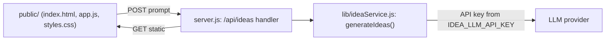

# Architecture Spine — BMAD Idea Launcher

## Design Paradigm

**Layered monolith**, one process: `presentation (static public/) → HTTP handler (server.js) → idea service → provider adapter`. No internal service split — a single-screen, single-endpoint MVP doesn't earn one. `[ADOPTED]` — ratified from the existing `server.js`, which already serves static assets and a stub `/api/ideas` handler via Node's core `http` module, no framework.

## Invariants & Rules

### AD-1 — No web framework

- **Binds:** all HTTP handling
- **Prevents:** a builder introducing Express/Fastify/etc. and diverging from the established convention
- **Rule:** `[ADOPTED]` HTTP routing and request/response handling stays on Node's core `http` module, matching `server.js` as it exists today.

### AD-2 — Idea Generation Service is a server-side-only adapter

- **Binds:** FR-2, FR-2 NFR
- **Prevents:** API key leakage to client code, or ad-hoc key reads scattered across handlers
- **Rule:** The Idea Generation Service is one provider-adapter function, called only from the server-side `/api/ideas` handler. The LLM API key is read from `process.env.IDEA_LLM_API_KEY` inside that adapter only, and is never included in any response body or client-served asset.

### AD-3 — All application state is client-side and session-only

- **Binds:** FR-1, FR-3, FR-4
- **Prevents:** introducing a DB, session store, cookies, or any server-side persistence the PRD puts out of scope; a stale prior request's state rendering against a newer one
- **Rule:** Prompt text, the three rendered ideas, and the favorite selection live only in a single client-side state object in `app.js`, for the lifetime of the page. The server is stateless across requests. The prompt `<input>` is a **controlled element** — every input/change event writes `state.prompt`, making it the always-current source of truth (not just captured at submit). Submitting a new prompt synchronously clears `ideas` and resets `favoritedIndex` to `null` **before** the fetch is dispatched.

### AD-4 — Favorite is single-select, client-owned

- **Binds:** FR-4
- **Prevents:** two independently-built units disagreeing on whether favorite state lives client- or server-side, on single- vs multi-select, or on toggle-off behavior
- **Rule:** Favorite state is one index (`favoritedIndex: number | null`) held client-side; the server has no concept of favorites. Clicking the currently-favorited card toggles `favoritedIndex` back to `null` (deselect); clicking a different card moves the favorite to it.

### AD-5 — `/api/ideas` is the sole backend endpoint, fixed contract

- **Binds:** FR-2 (30s target, inline error + retry)
- **Prevents:** the response shape drifting between today's hardcoded stub and the real provider call; two servers returning different status codes for the same failure class; double-dispatched LLM calls from independent client+server timeouts
- **Rule:** `POST /api/ideas` — request `{ prompt: string }`; success `200 { ideas: [{title, description}] }` with exactly 3 entries. Errors are always `{ error: string }` with a pinned code:
  - `400` — request body isn't valid JSON, `prompt` isn't a string, or trimmed `prompt` is empty or over 2000 chars. The handler wraps `JSON.parse` in try/catch (AD-1 forbids a framework body-parser safety net).
  - `504` — provider call exceeds the server-enforced timeout.
  - `502` — provider/network failure (the call fails before responding).
  - `500` — provider responded but output didn't parse into exactly 3 well-formed `{title, description}` entries. The adapter must throw on this — never pad, truncate, or fabricate entries to force conformance.

  Timeout is enforced **server-side only**, via `AbortController` on the provider call fixed at 25s (under the PRD's 30s end-to-end target), always resolving `504` before any client-side timeout would fire. The client fetch carries no separate abort/timeout of its own. The client always preserves the typed prompt on any error response (per AD-3, `state.prompt` already holds it). The client must not issue this request at all for an empty/whitespace-only prompt (PRD FR-2) — server-side `400` is a defense-in-depth backstop, not the primary gate.

### AD-6 — Handler/Adapter interface is fixed

- **Binds:** FR-2, AD-2
- **Prevents:** two AD-2-compliant adapters disagreeing on export name, call signature, or error-signaling and simply failing to interoperate with the handler
- **Rule:** The adapter is `module.exports.generateIdeas` in `lib/ideaService.js`, signature `(prompt: string) => Promise<Array<{title, description}>>` resolving to exactly 3 entries. Failures are signaled **only** by throwing — never by a resolved `{ error }` envelope — so the handler's single `try/catch` is the sole error path. The adapter never caches or memoizes a response — every call is a genuinely fresh LLM call, even for a repeated identical prompt (PRD counter-metric SM-C1: don't optimize latency by reusing responses).



## Consistency Conventions

| Concern | Convention |
| --- | --- |
| Naming (entities, files, interfaces, events) | `camelCase` in JS; idea object shape is always `{ title, description }`; no renaming across handler/adapter/client |
| Data & formats (ids, dates, error shapes, envelopes) | No ids/dates on the wire (session-only, no persistence). Errors always `{ error: string }`. No response envelope beyond the two shapes in AD-5. |
| Accessibility | The favorite highlight must be conveyed by more than color alone (e.g. a distinct border plus an icon/label change), per PRD FR-4 — never a background-color swap alone. |
| State & cross-cutting (mutation, errors, logging, config, auth) | State mutation only in the client's single state object (AD-3). No auth (PRD: no accounts). Config via environment variables only — `IDEA_LLM_API_KEY` is the fixed name for the LLM API key (AD-2) — never hardcoded. |

## Stack

| Name | Version |
| --- | --- |
| Node.js | `>=22` (local dev on `v22.15.0`, Maintenance LTS since 2025-10-21, EOL 2027-04-30; Node 24 recommended for a fresh setup — Active LTS 2025-10-28 to 2026-10-20) |
| Module system | CommonJS (`require`/`module.exports`, matching `server.js`) |
| Test runner | `node --test` (built-in, already wired via `npm test`) |
| Web framework | none — Node core `http` (AD-1) |

## Structural Seed

```text
{project-root}/
  server.js        # HTTP handler: static file serving + POST /api/ideas
  lib/
    ideaService.js  # generateIdeas(prompt) adapter (AD-6) -> LLM provider
  public/
    index.html      # single-screen layout: prompt input, Generate ideas button, card grid
    app.js           # client state (prompt, ideas, favoritedIndex) + fetch to /api/ideas
    styles.css        # responsive one-screen layout
  test/               # node --test specs
```

No server-side data model — the only shape crossing the wire is the idea object (`{ title, description }`), fixed in AD-5.

## Deferred

- LLM provider choice beyond the `[ASSUMPTION]` in the memlog (Anthropic Claude) — PRD Open Question 1 leaves this to the builder; AD-2's adapter boundary makes swapping providers a local change, not a spine violation.
- `localStorage` favorite persistence, a `Clear` button, a "How it works" note, a "Next step" hint (PRD §7.2, deferred if time allows) — no architecture needed unless picked up.
- Rate limiting / cost ceiling on `/api/ideas` (PRD Open Question 3) — no mechanism specified; revisit only if real usage beyond the builder's own testing occurs.
- **Deployment / environments / operations** — explicitly not architected. This is a local-only, single-builder learning exercise; no hosting target, CI/CD, or ops tooling is in scope for the MVP. If deployed beyond localhost, that needs its own pass (env config beyond `IDEA_LLM_API_KEY`, process manager, HTTPS termination).
- `PromptGateway/` (the in-repo FastAPI service) is **out of scope for this spine** — it backs the `prompt-gateway-guard` Claude Code skill/hook that validates prompts sent to Claude Code sessions, and has no runtime relationship to this app's `/api/ideas` flow. Noted so a future builder doesn't wire it in by mistake.
