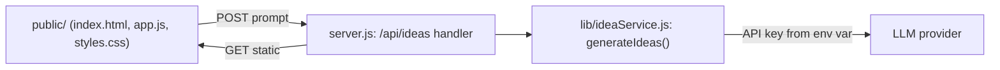

# Architecture Spine — BMAD Idea Launcher v2

`[NOTE, highest-priority]` A near-identical architecture spine already exists and is approved (`architecture-BMAD-2026-07-29`, v1, built from `prd-BMAD-2026-07-27`), covering this exact scope under its own AD-1 through AD-6. This spine was generated anyway, at the user's explicit request, after that redundancy was surfaced. Its `AD` numbering and content are largely re-derivations of that prior spine's decisions, retargeted to this PRD's FR-1/FR-2 IDs — see the memlog for the full reconciliation trail.

## Design Paradigm

**Layered monolith**, one process: `presentation (static public/) → HTTP handler (server.js) → idea service adapter → LLM provider`. No internal service split — a single-screen, single-endpoint app doesn't earn one. `[ADOPTED]` — ratified from the existing `server.js`/`public/` code, matching the prior spine's paradigm exactly.

## Invariants & Rules

### AD-1 — No web framework

- **Binds:** all HTTP handling
- **Prevents:** a builder introducing Express/Fastify/etc. and diverging from the established convention
- **Rule:** `[ADOPTED]` HTTP routing and request/response handling stays on Node's core `http` module, matching `server.js` as it exists today.

### AD-2 — Idea Generation Service is a server-side-only adapter

- **Binds:** FR-1
- **Prevents:** API key leakage to client code, or ad-hoc key reads scattered across handlers
- **Rule:** `[ADOPTED]` The Idea Generation Service is one provider-adapter function, called only from the server-side `/api/ideas` handler. The LLM API key is read from a server-side environment variable inside that adapter only, and is never included in any response body or client-served asset. `[ASSUMPTION: exact env var name is left open — the PRD is deliberately provider-agnostic, unlike the prior spine which fixed IDEA_LLM_API_KEY; see Deferred.]`

### AD-3 — All application state is client-side and session-only

- **Binds:** FR-1, FR-2
- **Prevents:** introducing a DB, session store, cookies, or any server-side persistence; a stale prior request's state rendering against a newer one
- **Rule:** `[ASSUMPTION: verified against the current codebase during review — public/app.js today is DOM-driven, not built around an explicit state object, so this is a new decision this spine introduces, not a ratification of existing reality.]` Prompt text, the three rendered ideas, and the favorite selection live only in a single client-side state object in `app.js`, for the lifetime of the page. The server is stateless across requests. The prompt input is a controlled element — every input/change event writes `state.prompt`. Submitting a new prompt synchronously clears `ideas` and resets `favoritedIndex` to `null` before the fetch is dispatched. The `Generate ideas` button is disabled for the duration of an in-flight request — no overlapping fetches or stale-response races are possible.

### AD-4 — Favorite is single-select, client-owned

- **Binds:** FR-2
- **Prevents:** disagreement on whether favorite state lives client- or server-side, on single- vs multi-select, or on toggle-off behavior
- **Rule:** `[ADOPTED]` Favorite state is one index (`favoritedIndex: number | null`) held client-side; the server has no concept of favorites. `[ASSUMPTION: the PRD's FR-2 specifies single-select and reassignment on a new pick, but is silent on click-to-deselect the currently-favorited card — this spine adds that behavior (clicking the favorited card toggles it back to null) as an architectural choice, not a stated PRD requirement.]` Clicking a different card moves the favorite to it.

### AD-5 — `/api/ideas` is the sole backend endpoint, fixed contract

- **Binds:** FR-1 (30s target per PRD SM-1, inline error + retry)
- **Prevents:** the response shape drifting between the stub and the real provider call; two servers returning different status codes for the same failure class; double-dispatched LLM calls from independent client+server timeouts
- **Rule:** `[ADOPTED]` `POST /api/ideas` — request `{ prompt: string }`; success `200 { ideas: [{title, description}] }` with exactly 3 entries. Errors are always `{ error: string }` with a pinned code:
  - `400` — request body isn't valid JSON, exceeds a 10KB raw-body size cap (rejected before JSON parsing — closes an unbounded-payload gap this review surfaced), `prompt` isn't a string, or trimmed `prompt` is empty or over 2000 chars.
  - `504` — provider call exceeds the server-enforced timeout (`AbortController` fixed at 25s, under the PRD's 30s end-to-end target). `[ASSUMPTION: the PRD's own Open Question 4 leaves it unresolved whether the 30s target still holds once a real LLM call replaces the stub; this spine fixes 25s/30s as a working baseline, not a settled answer — revisit if that question resolves toward a looser bound.]`
  - `502` — provider/network failure (the call fails before responding).
  - `500` — provider responded but output didn't parse into exactly 3 well-formed `{title, description}` entries (see AD-6 for the definition of well-formed), or the adapter threw with no `.code` / an unrecognized `.code`.

  Timeout is enforced server-side only, exclusively by the adapter's `AbortController` (AD-6) — **the handler must not start any timer or abort mechanism of its own**; a second, independent timeout would race the adapter's and could return `504` to the client while the underlying provider call is still in flight. The client fetch carries no separate abort/timeout of its own. The client always preserves the typed prompt on any error response. The client must not issue this request at all for an empty/whitespace-only prompt — server-side `400` is a defense-in-depth backstop, not the primary gate.

### AD-6 — Handler/adapter interface is fixed

- **Binds:** FR-1, AD-2
- **Prevents:** two AD-2-compliant adapters disagreeing on export name, call signature, or error-signaling and failing to interoperate with the handler
- **Rule:** `[ADOPTED]` The adapter is `module.exports.generateIdeas` in `lib/ideaService.js`, signature `(prompt: string) => Promise<Array<{title, description}>>` resolving to exactly 3 entries. **Well-formed** means: both `title` and `description` are strings that are non-empty after trimming; no other shape or length constraint is imposed. Failures are signaled only by throwing — never by a resolved `{ error }` envelope — so the handler's single `try/catch` is the sole error path. **Validation and repair of the provider's output happens only inside the adapter — the handler must not itself re-validate, truncate, pad, or otherwise alter the resolved `ideas` array**; an adapter that resolves is trusted as-is by the handler. The adapter never caches or memoizes a response — every call is a genuinely fresh LLM call, even for a repeated identical prompt (PRD counter-metric SM-C1). The adapter reads its environment variable(s) once, at module load — never lazily per-call — so key/config state can't drift mid-process or vary across test runs.

  Thrown errors carry a `.code` property — one of `'TIMEOUT' | 'NETWORK' | 'MALFORMED'` — which the handler maps to AD-5's status codes (`TIMEOUT`→504, `NETWORK`→502, `MALFORMED`→500; any thrown error with no `.code` or an unrecognized `.code`→500). The adapter owns and creates the `AbortController` internally, passing its `signal` directly to the outbound provider call — this is the *only* timeout mechanism in the request path (see AD-5).

  **Testing:** `node --test` specs for the adapter and for `/api/ideas` must mock the outbound provider call (e.g. mock `fetch`) — no test run makes a real LLM call.



## Consistency Conventions

| Concern | Convention |
| --- | --- |
| Naming (entities, files, interfaces, events) | `camelCase` in JS; idea object shape is always `{ title, description }`; no renaming across handler/adapter/client |
| Data & formats (ids, dates, error shapes, envelopes) | No ids/dates on the wire (session-only, no persistence). Errors always `{ error: string }`. No response envelope beyond the two shapes in AD-5. |
| Accessibility | The favorite highlight must be conveyed by more than color alone (e.g. a distinct border plus an icon/label change), per PRD FR-2 — never a background-color swap alone. |
| State & cross-cutting (mutation, errors, logging, config, auth) | State mutation only in the client's single state object (AD-3). No auth. Config via environment variables only — exact key name left open (see AD-2, Deferred). |

## Stack

| Name | Version |
| --- | --- |
| Node.js | `>=24` (Active LTS as of mid-2026, through Apr 2028; Node 22 has moved to Maintenance LTS through Apr 2027 — verified via web research during review) |
| Module system | CommonJS (`require`/`module.exports`, matching `server.js`) |
| Test runner | `node --test` (built-in) |
| Web framework | none — Node core `http` (AD-1) |

## Structural Seed

```text
{project-root}/
  server.js        # HTTP handler: static file serving + POST /api/ideas
  lib/
    ideaService.js  # generateIdeas(prompt) adapter (AD-6) -> LLM provider
  public/
    index.html      # single-screen layout: prompt input, Generate ideas button, card grid
    app.js           # client state (prompt, ideas, favoritedIndex) + fetch to /api/ideas
    styles.css        # responsive one-screen layout
  test/               # node --test specs
```

No server-side data model — the only shape crossing the wire is the idea object (`{ title, description }`), fixed in AD-5.

## Deferred

- LLM provider/model choice and the exact env-var name for the API key (PRD Open Question 3) — the PRD is deliberately provider-agnostic; AD-2's adapter boundary makes this a local, swappable choice, not a spine violation. `[NOTE: an existing implementation-artifact story doc (1-1-real-llm-backed-idea-generation.md) already assumes Anthropic Claude and an IDEA_LLM_API_KEY env var, and flags that a specific model ID could not be reliably confirmed — this concrete, already-assumed detail is what needs reconciling before implementation, per PRD Open Question 3. Until that reconciliation happens, a builder extending that existing work should default to the same IDEA_LLM_API_KEY name rather than pick a new one, to avoid two independently-built units disagreeing on the env var — this is a recommendation, not a spine-fixed Rule, since the PRD leaves it open.]`
- `localStorage` favorite persistence — not in scope for this PRD.
- Rate limiting / cost ceiling on `/api/ideas` — no mechanism specified; revisit only if real usage beyond testing occurs.
- **Deployment / environments / operations** — explicitly not architected. Local-only, single-builder learning exercise; no hosting target, CI/CD, or ops tooling in scope.
- `PromptGateway/` integration — explicitly out of scope per the PRD (Open Question 5, unresolved). No runtime relationship to this app's `/api/ideas` flow is assumed.
- Reconciliation with the pre-existing, near-identical approved spine (`architecture-BMAD-2026-07-29`) — this document was generated as a separate pass at the user's request rather than reusing that spine; whether the two should be merged or one retired is not decided here.
