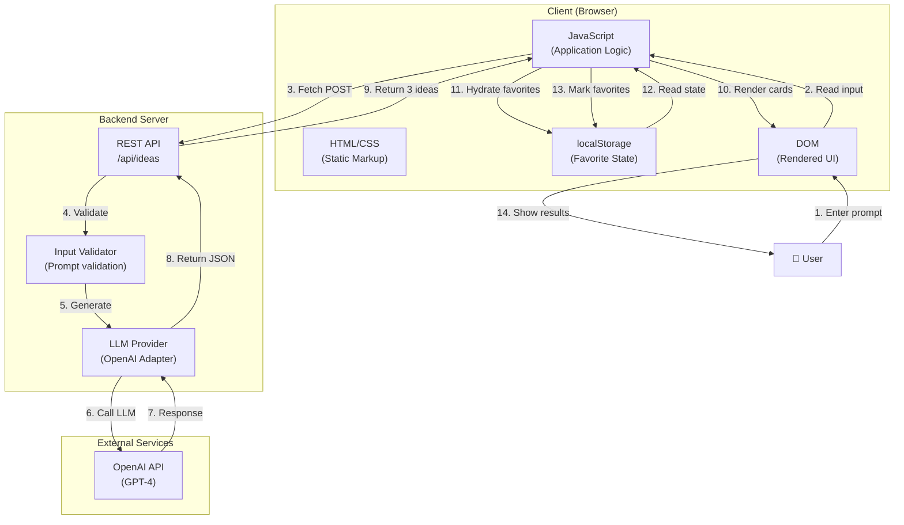
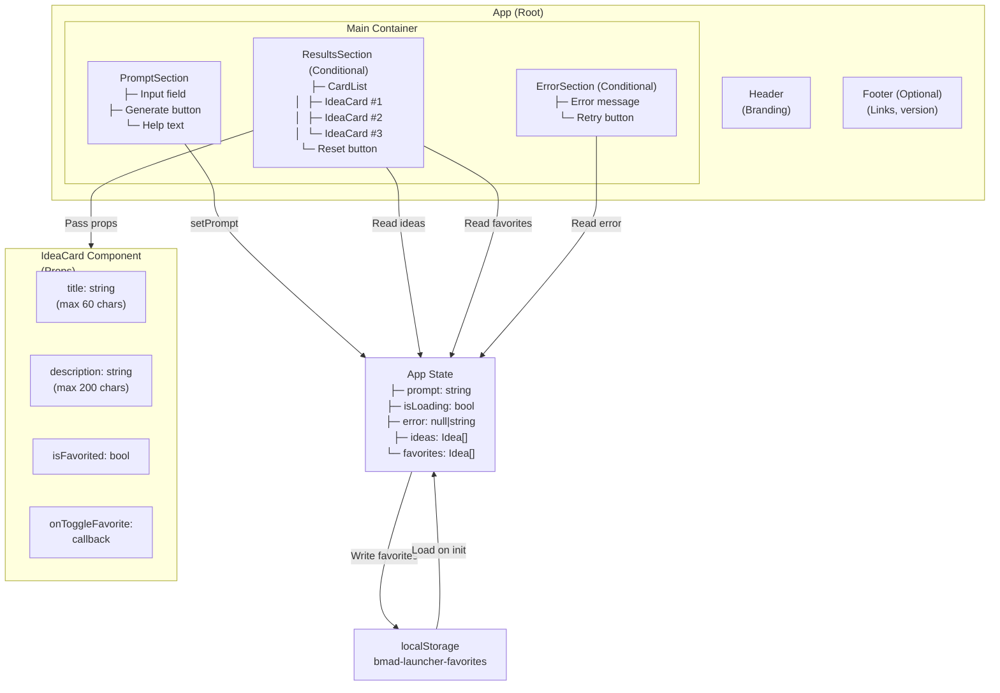
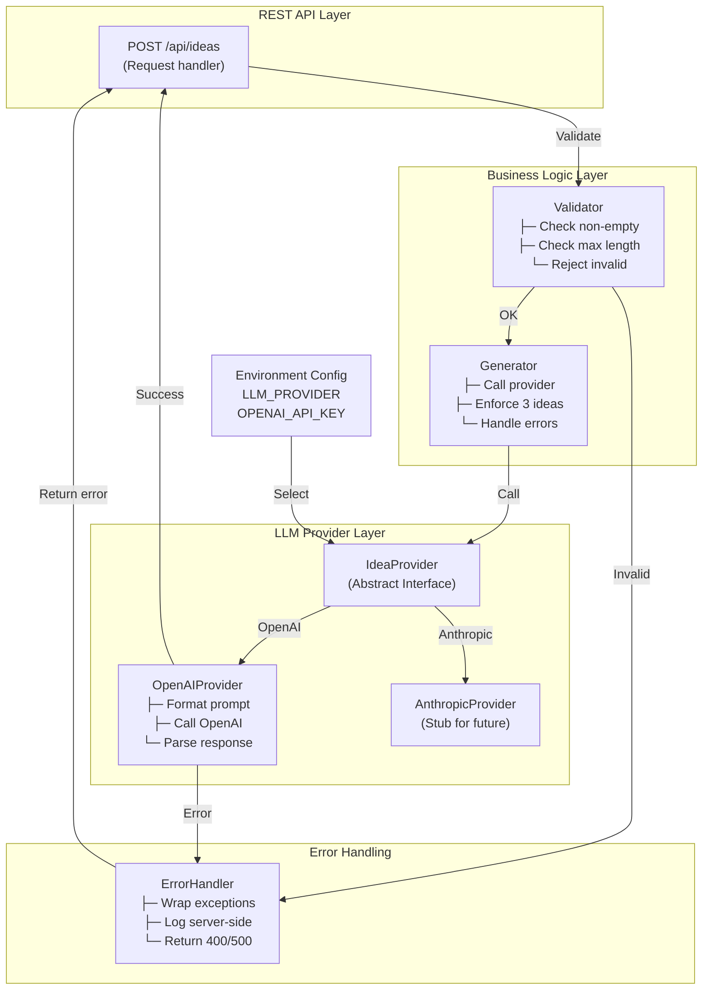
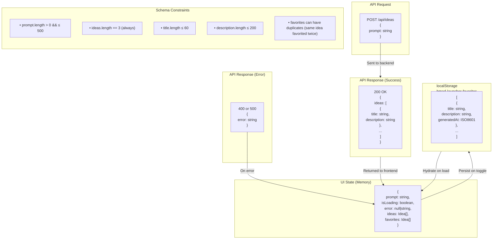
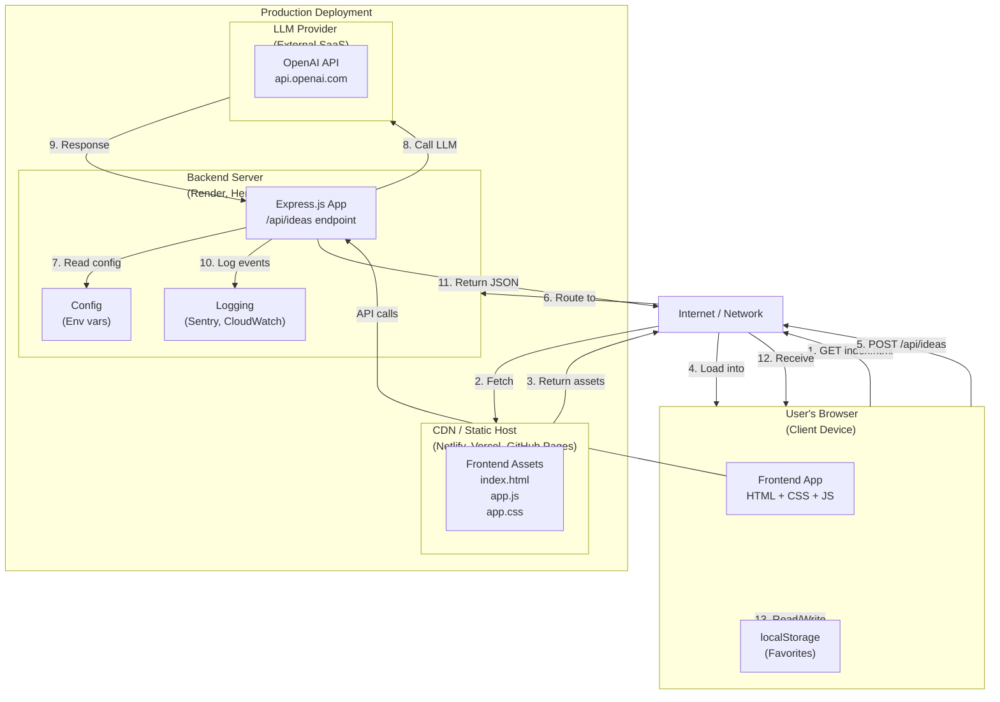
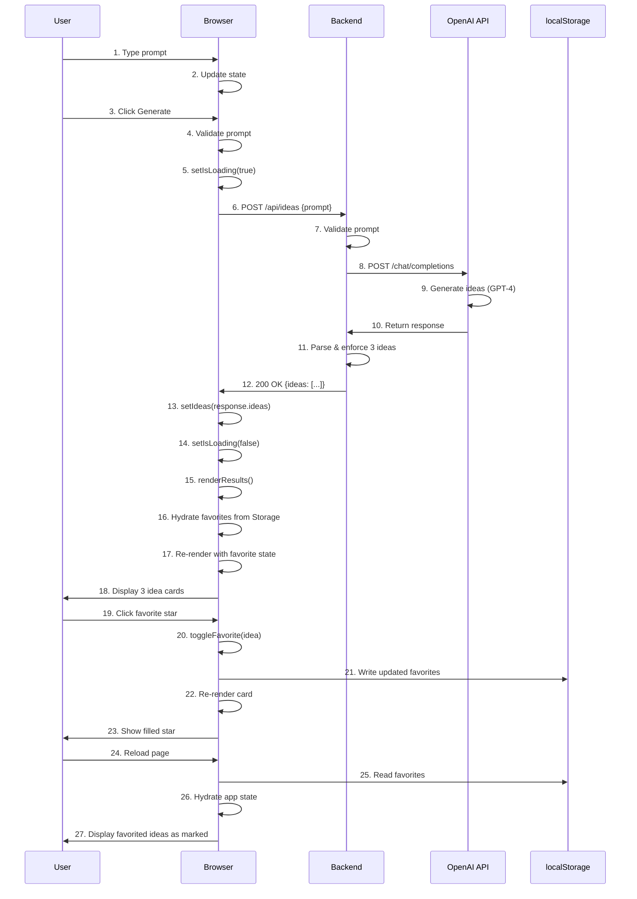
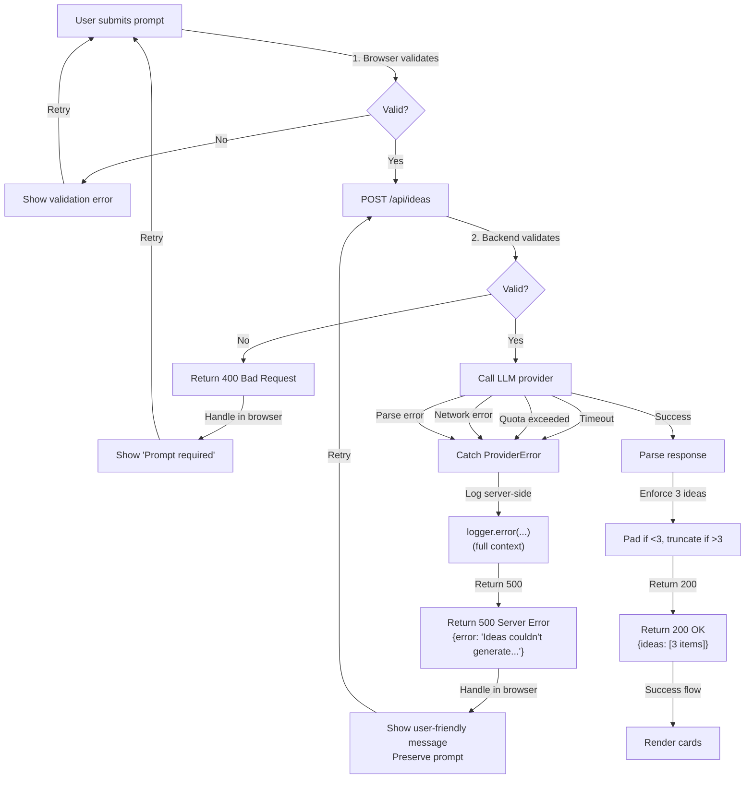
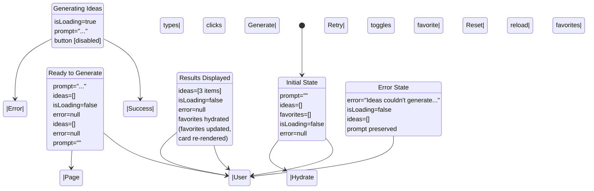
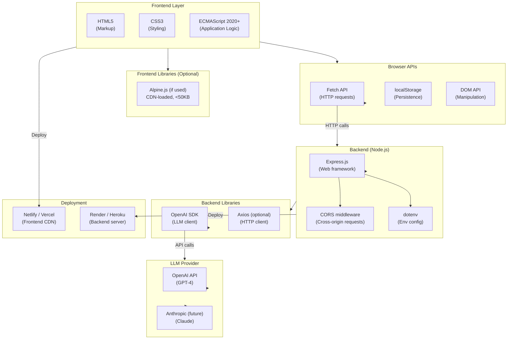

# System Architecture Diagrams (C4 Model)

This document provides visual representations of the BMAD Idea Launcher architecture at multiple levels of detail: System Context, Container, Component, and Code views.

---

## Level 1: System Context Diagram

Shows the BMAD Idea Launcher and its external dependencies.

```mermaid
graph TB
    User["👤 User<br/>(BMAD Learner)"]
    Browser["🌐 Web Browser<br/>(Frontend App)"]
    Backend["🖥️ Backend Server<br/>(REST API)"]
    LLM["🧠 OpenAI API<br/>(GPT-4 or equivalent)"]
    LocalStorage["💾 localStorage<br/>(Browser Storage)"]

    User -->|Uses| Browser
    Browser -->|HTTP POST<br/>/api/ideas| Backend
    Backend -->|API Call<br/>GPT-4| LLM
    LLM -->|JSON Response<br/>3 ideas| Backend
    Backend -->|HTTP 200<br/>{ideas: [...]}| Browser
    Browser -->|Read/Write| LocalStorage
    Browser -->|Display Results| User
    User -->|Save to favorites| Browser
```

**Key Interactions:**

- User enters prompt in browser
- Browser sends prompt to backend
- Backend calls OpenAI (or pluggable provider)
- Backend returns exactly 3 ideas
- Browser renders ideas and manages favorite state locally

---

## Level 2: Container Diagram

Shows the major components and how they communicate.



**Key Containers:**

- **Client (Browser):** HTML markup, JS logic, localStorage
- **Backend Server:** REST API, input validation, LLM provider abstraction
- **External Services:** OpenAI or other LLM provider

---

## Level 3: Component Diagram (Frontend)

Shows the frontend component tree and data flow.



**Key Components:**

- **PromptSection** — Input field + button
- **ResultsSection** — Grid of 3 idea cards
- **ErrorSection** — Error message + retry
- **IdeaCard** — Reusable card component

**Key State:**

- `prompt` — Current input
- `isLoading` — Generation in progress
- `ideas` — Current result set (3 items)
- `favorites` — Persisted favorite set

---

## Level 3: Component Diagram (Backend)

Shows the backend component tree and dependencies.



**Key Layers:**

- **API Layer** — HTTP request handling
- **Business Logic** — Validation, generation, error wrapping
- **Provider Layer** — LLM abstraction (pluggable)
- **Error Handling** — Graceful failure, user-safe messages

**Key Principle:** Backend is thin and stateless; all state lives on the client or in localStorage.

---

## Level 4: Code Structure Diagram

Shows file organization and module relationships.

```
Frontend (Client-Side)
└── index.html                          (Single page entry point)
    ├── <style>                         (Inline or external CSS)
    │   ├── .main-container
    │   ├── .prompt-section
    │   ├── .results-section
    │   ├── .idea-card-list
    │   ├── .idea-card
    │   ├── .idea-card.favorited
    │   └── media queries (mobile-first)
    │
    ├── <script>                        (Vanilla JS application logic)
    │   ├── const API_BASE
    │   ├── let state = {...}           (Local app state)
    │   ├─ function loadFavoritesFromStorage()
    │   ├─ function saveFavoritesToStorage()
    │   ├─ async function handleGenerate()
    │   ├─ function renderResults()
    │   ├─ function handleToggleFavorite()
    │   ├─ function handleReset()
    │   ├─ function handleRetry()
    │   └─ ... utility functions
    │
    └── localStorage key: "bmad-launcher-favorites"
        └── [{title, description, generatedAt}, ...]

Backend (Server-Side)
├── server.js (or main.py)              (Express app entry point)
│
├── routes/
│   └── api.js (or api.py)
│       └── POST /api/ideas
│
├── middleware/
│   ├── validation.js                   (Prompt validation)
│   └── errorHandler.js                 (Error wrapping)
│
├── services/
│   ├── ideaService.js                  (Generation logic)
│   └── providers/
│       ├── ideaProvider.js             (Abstract interface)
│       ├── openaiProvider.js           (OpenAI implementation)
│       └── anthropicProvider.js        (Anthropic stub)
│
├── utils/
│   ├── logger.js                       (Logging)
│   └── config.js                       (Env var loading)
│
└── .env                                (Environment variables)
    ├── LLM_PROVIDER=openai
    ├── OPENAI_API_KEY=...
    ├── LOG_LEVEL=info
    └── PORT=3000
```

---

## Data Model Diagram

Shows the structure of data at rest and in transit.



---

## Deployment Architecture Diagram

Shows how components are deployed and communicate.



**Deployment Notes:**

- **Frontend:** Static files (CDN or simple server)
- **Backend:** Node.js server on Platform-as-a-Service (Heroku, Render)
- **LLM:** Managed service (OpenAI, Anthropic)
- **Monitoring:** Optional logging service (Sentry, CloudWatch)

---

## Request-Response Flow Diagram

Shows the complete lifecycle of a generation request.



---

## Error Handling Flow Diagram

Shows how errors are handled at each layer.



---

## State Transition Diagram

Shows how the frontend state machine transitions through different states.



---

## Responsive Layout Diagram

Shows how the layout adapts across breakpoints (AD-5).

```
Mobile (≤600px)
┌─────────────────────┐
│      Header         │
├─────────────────────┤
│   [Input field]     │
│  [Generate Button]  │
├─────────────────────┤
│    [Idea Card 1]    │
├─────────────────────┤
│    [Idea Card 2]    │
├─────────────────────┤
│    [Idea Card 3]    │
├─────────────────────┤
│  [Reset Button]     │
└─────────────────────┘

Tablet (601–1000px)
┌──────────────────────────────────────┐
│            Header                    │
├──────────────────────────────────────┤
│   [Input field]  [Generate Button]   │
├──────────────────────────────────────┤
│  [Idea Card 1]    [Idea Card 2]      │
├──────────────────────────────────────┤
│  [Idea Card 3]                       │
├──────────────────────────────────────┤
│  [Reset Button]                      │
└──────────────────────────────────────┘

Desktop (>1000px)
┌────────────────────────────────────────────────────────────┐
│                        Header                              │
├────────────────────────────────────────────────────────────┤
│     [Input field]              [Generate Button]           │
├────────────────────────────────────────────────────────────┤
│  [Idea Card 1]      [Idea Card 2]      [Idea Card 3]       │
├────────────────────────────────────────────────────────────┤
│  [Reset Button]                                            │
└────────────────────────────────────────────────────────────┘
```

---

## Technology Stack Diagram

Shows the complete technology stack and dependencies.



---

## Conclusion

These diagrams provide visual representations of the BMAD Idea Launcher architecture at multiple levels of abstraction:

- **System Context** — External dependencies (user, browser, backend, LLM)
- **Container** — Major components and communication
- **Component** — Frontend and backend component trees
- **Code** — File organization and modules
- **Data Model** — Schema and data flow
- **Deployment** — Production infrastructure
- **Request-Response** — Complete user journey
- **Error Handling** — Failure scenarios
- **State Transitions** — UI state machine
- **Responsive Design** — Layout adaptation
- **Technology Stack** — All dependencies

Use these diagrams to onboard new team members, communicate design decisions, and verify implementation against the architecture.
