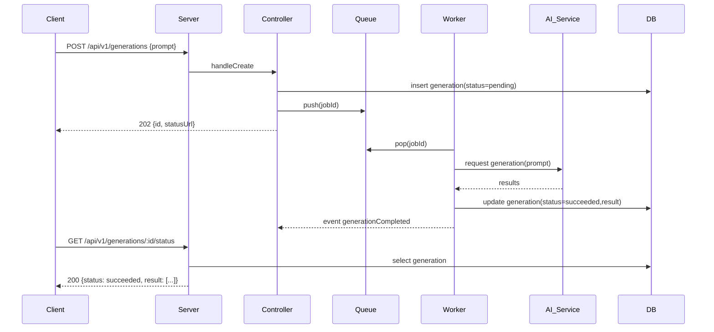
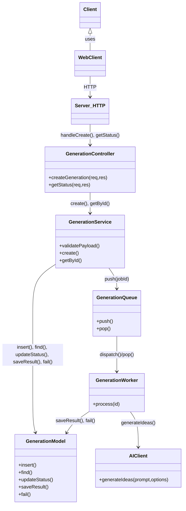

Suggested filename: \_bmad-output/planning-artifacts/implementation-artifacts/story-1.1-lld.md

**Summary**

- Purpose: Low-Level Design for Story 1.1 — Enter a prompt and submit a generation request.
- Story file: [ \_bmad-output/planning-artifacts/epics/epic-1-capture-and-generate-starter-ideas/story-1.1-enter-a-prompt-and-submit-a-generation-request.md ](_bmad-output/planning-artifacts/epics/epic-1-capture-and-generate-starter-ideas/story-1.1-enter-a-prompt-and-submit-a-generation-request.md#L1-L8)

**Goals & Acceptance Criteria**

- Goals: Allow the user to type a meaningful prompt and submit a generation request; show clear busy state while generation runs; prevent submission for empty/meaningless prompts.
- Acceptance Criteria (from story):
  - Given the app is loaded and the prompt field is visible
  - When the user enters a non-empty prompt and clicks Generate ideas
  - Then the app starts the generation flow and shows a clear loading or busy state
  - And the app prevents submission until the prompt contains meaningful text

If not present in story, derived explicit ACs (implementation-ready):

- AC-1: `Generate` button disabled for empty or invalid prompt (validation rules defined below).
- AC-2: On submit, `Generate` button and prompt input become disabled; a visible spinner or overlay appears and is announced to screen readers.
- AC-3: On success, generated items are displayed in Ideas area and the busy state clears.
- AC-4: On failure, an error message is shown and retry is possible.
- AC-5: Network/API errors handled with appropriate HTTP status flows and user messaging.

---

**API & Data Model Changes**

1. Endpoint(s)

- POST /api/v1/generations
  - Description: Accept prompt -> start generation (sync or queued depending on load); returns job or result.
  - Success (synchronous MVP): 200 OK with results array.
  - Preferred (scalable): 202 Accepted with jobId and status endpoint.

- GET /api/v1/generations/:id/status
  - Description: Pollable status endpoint for async flow.
  - 200 OK: { id, status: "pending|running|succeeded|failed", progress?, result? }

2. Request / Response payloads (JSON)

- POST /api/v1/generations (request)
  - Content-Type: application/json
  - Body:
    {
    "prompt": "string",
    "options": {
    "ideaCount": 3, // optional, default 3
    "temperature": 0.8 // optional AI generation tuning
    },
    "meta": {
    "userId": "optional-string"
    }
    }

- POST /api/v1/generations (sync success response - simple MVP)
  - 200
    {
    "id": "uuid",
    "status": "succeeded",
    "result": [
    {"title":"Idea A", "description":"..."},
    {"title":"Idea B", "description":"..."},
    {"title":"Idea C", "description":"..."}
    ]
    }

- POST /api/v1/generations (async accepted)
  - 202
    {
    "id": "uuid",
    "status": "pending",
    "statusUrl": "/api/v1/generations/:id/status"
    }

- GET /api/v1/generations/:id/status (poll)
  - 200
    {
    "id": "uuid",
    "status": "pending|running|succeeded|failed",
    "result": [ ... ] // present only for succeeded
    "error": { "code":"AI_ERROR", "message":"..." } // when failed
    }

3. Validation rules

- `prompt`:
  - required, must be string
  - trimmed length >= 10 characters OR at least 3 words (choose one for implementation). Proposed: trimmed length >= 10 and wordCount >= 2.
  - reject prompts containing only punctuation/whitespace.
- `options.ideaCount`: integer between 1 and 10 (default 3)
- `options.temperature`: number between 0 and 1
- Response codes:
  - 400 Bad Request for validation failures: { code: "VALIDATION_ERROR", fieldErrors: {prompt: "must be non-empty"} }
  - 429 Too Many Requests if rate-limited
  - 500 Internal Server Error for unexpected errors
  - 503 Service Unavailable if AI service unreachable

4. Error responses (examples)

- 400:
  {
  "code":"VALIDATION_ERROR",
  "message":"prompt must be at least 10 characters",
  "fieldErrors": { "prompt": "too short" }
  }
- 502:
  {
  "code":"AI_INTEGRATION_ERROR",
  "message":"AI provider returned error",
  "details": { "provider":"openai", "status":502 }
  }

---

**Frontend: UI / UX Details**

Target: plain JS (existing public/index.html + public/app.js). Minimal new components (organized as simple modules/functions).

Components (file suggestions in File Layout)

- PromptArea (UI composed in public/index.html / public/app.js)
  - Elements:
    - label + textarea#promptInput (rows 3-4)
    - small helper text (e.g., "Describe your problem in one sentence")
    - Generate button button#generateBtn
    - optional IdeaCount select or input
  - Props / State (conceptual):
    - state.promptText: string
    - state.isValid: boolean (computed)
    - state.isSubmitting: boolean
    - state.errorMessage: string | null
    - state.ideas: array | null

Accessibility notes:

- Associate label with textarea (for attribute).
- `Generate` button must be reachable by keyboard; use `<button>` element.
- Use `aria-disabled` and disabled attribute when submitting.
- Provide live region for status updates:
  - <div id="generationStatus" aria-live="polite"></div>
  - Announce "Generating ideas…" when submission starts.
- Error region should use role="alert".
- Ensure color contrast for disabled states and spinner.

Interactions

- Validation live: trim input, update isValid; button disabled when invalid.
- On click Generate:
  - set isSubmitting=true, disable input/button
  - set status message "Generating ideas…"
  - POST to /api/v1/generations
  - If response 200: populate `ideas`, set isSubmitting=false
  - If 202: poll statusUrl until succeeded/failed (every 1s with exponential backoff)
  - Show spinner overlay or inline spinner element
  - On error: show message in error region and set isSubmitting=false

UI states

- Idle: prompt input enabled, button enabled when valid.
- Submitting: spinner visible, input/button disabled, status message visible.
- Success: show list of generated idea cards with title & description; allow Save/ Favorite (future).
- Error: show inline alert with retry button.

Frontend snippet (copy-paste ready):

```html
<!-- Add into public/index.html where prompt area belongs -->
<div id="prompt-area">
  <label for="promptInput">Enter prompt</label>
  <textarea id="promptInput" rows="3" aria-describedby="promptHelp"></textarea>
  <div id="promptHelp">Describe the problem you want ideas for.</div>
  <button id="generateBtn" disabled>Generate ideas</button>
  <div id="generationStatus" aria-live="polite"></div>
  <div id="generationError" role="alert" aria-atomic="true"></div>
  <div id="ideasContainer"></div>
</div>
```

Minimal client JS to wire behavior (place in public/app.js or new public/generate.js):

```javascript
// public/generate.js (ES module or loaded script)
(function () {
  const promptInput = document.getElementById("promptInput");
  const generateBtn = document.getElementById("generateBtn");
  const statusEl = document.getElementById("generationStatus");
  const errorEl = document.getElementById("generationError");
  const ideasEl = document.getElementById("ideasContainer");

  function isMeaningful(text) {
    const t = (text || "").trim();
    if (t.length < 10) return false;
    const words = t.split(/\s+/).filter(Boolean);
    return words.length >= 2;
  }

  function setSubmitting(flag) {
    promptInput.disabled = flag;
    generateBtn.disabled = flag || !isMeaningful(promptInput.value);
    generateBtn.setAttribute("aria-disabled", !!flag);
    statusEl.textContent = flag ? "Generating ideas…" : "";
  }

  promptInput.addEventListener("input", () => {
    generateBtn.disabled = !isMeaningful(promptInput.value);
    errorEl.textContent = "";
  });

  generateBtn.addEventListener("click", async () => {
    const prompt = promptInput.value.trim();
    if (!isMeaningful(prompt)) return;
    setSubmitting(true);
    errorEl.textContent = "";
    ideasEl.innerHTML = "";
    try {
      const res = await fetch("/api/v1/generations", {
        method: "POST",
        headers: { "Content-Type": "application/json" },
        body: JSON.stringify({ prompt, options: { ideaCount: 3 } }),
      });
      if (res.status === 202) {
        const data = await res.json();
        await pollStatus(data.statusUrl, data.id);
      } else if (res.ok) {
        const data = await res.json();
        renderIdeas(data.result || []);
      } else {
        const err = await res.json().catch(() => ({ message: "Server error" }));
        throw new Error(err.message || "Generation failed");
      }
    } catch (e) {
      errorEl.textContent = e.message;
    } finally {
      setSubmitting(false);
    }
  });

  async function pollStatus(url, id) {
    for (let attempt = 0; attempt < 12; attempt++) {
      await new Promise((r) =>
        setTimeout(r, Math.min(1000 * Math.pow(1.5, attempt), 5000)),
      );
      const r = await fetch(url);
      if (!r.ok) throw new Error("Status check failed");
      const j = await r.json();
      if (j.status === "succeeded") {
        renderIdeas(j.result || []);
        return;
      }
      if (j.status === "failed") {
        throw new Error(j.error?.message || "Generation failed");
      }
    }
    throw new Error("Generation timed out");
  }

  function renderIdeas(ideas) {
    ideasEl.innerHTML = ideas
      .map(
        (i) =>
          `<div class="idea-card"><h3>${escapeHtml(i.title)}</h3><p>${escapeHtml(i.description)}</p></div>`,
      )
      .join("");
  }

  function escapeHtml(s) {
    return (s || "").replace(
      /[&<>"']/g,
      (c) =>
        ({
          "&": "&amp;",
          "<": "&lt;",
          ">": "&gt;",
          '"': "&quot;",
          "'": "&#39;",
        })[c],
    );
  }
})();
```

---

**Backend Design**

Assumptions: Node.js + Express server (project root contains server.js). We will add modular routes/controllers/services.

Components (server-side)

- Route: server/routes/generations.js
- Controller: server/controllers/generationController.js
- Service: server/services/generationService.js
- AI integration client: server/integrations/aiClient.js
- Model / persistence: server/models/generationModel.js (lightweight SQLite using better-sqlite3 or JSON store for MVP)
- Optional queue: server/queues/generationQueue.js (in-process queue or RabbitMQ for scale)
- Worker: server/workers/generationWorker.js (consumes queue and calls AI)

Sequence (preferred async flow)

1. Client POST /api/v1/generations -> controller
2. Controller validates payload, creates DB record with status "pending" and returns 202 with statusUrl.
3. Controller enqueues job (jobId == generation.id)
4. Worker dequeues job and calls AI client with prompt and options.
5. On success worker writes result to DB and sets status "succeeded"; emits event GenerationCompleted.
6. Client polls statusUrl until status is succeeded, then fetches result.

Mermaid sequence diagram:



**UML (Class) Diagram**

The following UML class-style diagram shows the main server-side components and their relationships for Story 1.1.



Data model (generation record)

- id: uuid
- prompt: text
- options: json
- status: enum('pending','running','succeeded','failed')
- result: json (array of ideas)
- error: json nullable
- createdAt, updatedAt, startedAt, finishedAt
- userId nullable

Persistence options

- MVP: file-based JSON store (server/data/generations.json) or lowdb
- Better: SQLite (`server/data/generations.sqlite`) with simple table
- Production: Postgres or other DB.

Backend code skeletons (Express)

server/routes/generations.js

```javascript
const express = require("express");
const router = express.Router();
const controller = require("../controllers/generationController");

router.post("/", controller.createGeneration);
router.get("/:id/status", controller.getStatus);

module.exports = router;
```

server/controllers/generationController.js

```javascript
const GenerationService = require("../services/generationService");

exports.createGeneration = async (req, res) => {
  const { prompt, options, meta } = req.body || {};
  const validation = GenerationService.validatePayload({ prompt, options });
  if (!validation.ok)
    return res.status(400).json({
      code: "VALIDATION_ERROR",
      message: validation.message,
      fieldErrors: validation.errors,
    });
  try {
    const generation = await GenerationService.create({
      prompt,
      options,
      meta,
    });
    // Async accepted
    res.status(202).json({
      id: generation.id,
      status: generation.status,
      statusUrl: `/api/v1/generations/${generation.id}/status`,
    });
  } catch (err) {
    console.error(err);
    res
      .status(500)
      .json({ code: "SERVER_ERROR", message: "Could not create generation" });
  }
};

exports.getStatus = async (req, res) => {
  const id = req.params.id;
  const gen = await GenerationService.getById(id);
  if (!gen) return res.status(404).json({ code: "NOT_FOUND" });
  res.json({
    id: gen.id,
    status: gen.status,
    result: gen.result,
    error: gen.error,
  });
};
```

server/services/generationService.js (core logic)

```javascript
const db = require("../models/generationModel");
const queue = require("../queues/generationQueue");
const { v4: uuidv4 } = require("uuid");

function validatePayload({ prompt, options }) {
  if (!prompt || typeof prompt !== "string")
    return {
      ok: false,
      message: "prompt required",
      errors: { prompt: "required" },
    };
  if (prompt.trim().length < 10)
    return {
      ok: false,
      message: "prompt too short",
      errors: { prompt: "too short" },
    };
  return { ok: true };
}

async function create({ prompt, options = {}, meta = {} }) {
  const id = uuidv4();
  const record = {
    id,
    prompt,
    options,
    status: "pending",
    result: null,
    error: null,
    createdAt: new Date().toISOString(),
  };
  await db.insert(record);
  await queue.push(id);
  return record;
}

async function getById(id) {
  return db.find(id);
}

module.exports = { validatePayload, create, getById };
```

server/integrations/aiClient.js

```javascript
const fetch = require("node-fetch");

async function generateIdeas(prompt, options = {}) {
  // Example for OpenAI-compatible API
  const body = {
    model: process.env.AI_MODEL || "gpt-4o-mini",
    prompt: `Generate ${options.ideaCount || 3} ideas for: ${prompt}`,
    max_tokens: 500,
    temperature: options.temperature ?? 0.8,
  };
  const res = await fetch(process.env.AI_ENDPOINT, {
    method: "POST",
    headers: {
      Authorization: `Bearer ${process.env.AI_API_KEY}`,
      "Content-Type": "application/json",
    },
    body: JSON.stringify(body),
  });
  if (!res.ok) throw new Error("AI service error");
  const j = await res.json();
  // Transform provider response to array of {title,description}
  return transformProviderResponse(j);
}
module.exports = { generateIdeas };
```

server/queues/generationQueue.js (simple in-process queue)

```javascript
const queue = [];
const listeners = [];
module.exports = {
  push: async (id) => {
    queue.push(id);
    process.nextTick(() => consume());
  },
  pop: () => queue.shift(),
};

async function consume() {
  while (queue.length) {
    const id = queue.shift();
    // spawn worker logic in separate microtask
    require("../workers/generationWorker").process(id).catch(console.error);
  }
}
```

server/workers/generationWorker.js

```javascript
const ai = require("../integrations/aiClient");
const db = require("../models/generationModel");

async function process(id) {
  await db.updateStatus(id, "running", { startedAt: new Date().toISOString() });
  const gen = await db.find(id);
  try {
    const result = await ai.generateIdeas(gen.prompt, gen.options);
    await db.saveResult(id, result, { finishedAt: new Date().toISOString() });
    // optionally emit event
  } catch (err) {
    await db.fail(id, err.message);
  }
}
module.exports = { process };
```

server/models/generationModel.js (file-backed simple implementation)

```javascript
const fs = require("fs");
const path = require("path");
const FILE = path.join(__dirname, "../../server/data/generations.json");
let data = {};
try {
  data = JSON.parse(fs.readFileSync(FILE, "utf8") || "{}");
} catch (e) {
  data = {};
}
function persist() {
  fs.writeFileSync(FILE, JSON.stringify(data, null, 2));
}
async function insert(record) {
  data[record.id] = record;
  persist();
}
async function find(id) {
  return data[id] || null;
}
async function updateStatus(id, status, partial) {
  if (!data[id]) return;
  data[id].status = status;
  Object.assign(data[id], partial || {});
  persist();
}
async function saveResult(id, result, partial) {
  if (!data[id]) return;
  data[id].status = "succeeded";
  data[id].result = result;
  Object.assign(data[id], partial || {});
  persist();
}
async function fail(id, errMsg) {
  if (!data[id]) return;
  data[id].status = "failed";
  data[id].error = { message: errMsg };
  persist();
}
module.exports = { insert, find, updateStatus, saveResult, fail };
```

Security & rate-limiting

- Add per-IP or per-user rate limits on POST /api/v1/generations (e.g., 1 request per 5s)
- Sanitize prompt storage (avoid injection risks)
- Limit max prompt length (e.g., 2000 chars)
- Keep AI API keys in env vars, never commit

Environment variables

- AI_API_KEY, AI_ENDPOINT, AI_MODEL, GENERATIONS_STORE_PATH

---

**File & Folder Layout Suggestions**

- server/
  - controllers/
    - generationController.js
  - routes/
    - generations.js
  - services/
    - generationService.js
  - integrations/
    - aiClient.js
  - queues/
    - generationQueue.js
  - workers/
    - generationWorker.js
  - models/
    - generationModel.js
  - data/
    - generations.json (or generations.sqlite)
  - tests/
    - unit/
      - generationService.test.js
    - integration/
      - generation.api.test.js

- public/
  - generate.js (or extend public/app.js)
  - components/ (optional)
    - promptArea.js
  - index.html (modify)

- test/
  - story1.test.js (E2E or Playwright/Cypress)

- \_bmad-output/planning-artifacts/implementation-artifacts/
  - story-1.1-lld.md (this file)
  - story-1.1-tasks.md (auto-generated TODO list)

---

**Minimal Code Skeletons / Pseudocode**

- Add route registration in server.js:

```javascript
// in server.js (existing)
const generationRoutes = require("./server/routes/generations");
app.use("/api/v1/generations", generationRoutes);
```

- Example of DB insert + queue push is in service skeletons above.

- Simple testable mock for AI (for local dev):

```javascript
// server/integrations/aiClient.mock.js
async function generateIdeas(prompt, options) {
  const ideas = [];
  for (let i = 1; i <= (options.ideaCount || 3); i++) {
    ideas.push({
      title: `Idea ${i} for ${prompt.slice(0, 20)}`,
      description: `Auto-generated idea ${i}`,
    });
  }
  return ideas;
}
module.exports = { generateIdeas };
```

Use this when process.env.NODE_ENV === 'test' or NODE_ENV === 'dev-local'.

---

**Test Plan**

Unit tests

- generationService.validatePayload
  - valid prompt -> ok true
  - prompt too short -> returns validation error
- generationController.createGeneration
  - invalid payload -> returns 400
  - valid payload -> returns 202 and creates DB record (mock db)
- aiClient.generateIdeas
  - mock provider -> returns array shape

Integration tests

- POST /api/v1/generations with valid prompt:
  - expect 202 + statusUrl; following GET to statusUrl eventually returns succeeded with result (simulate worker or use mock aiClient)
- POST with invalid prompt -> 400 and fieldErrors
- Simulated AI provider failure -> 502 / server returns 202 then status==failed with error

E2E scenarios (Cypress / Playwright)

- Scenario 1 (happy path)
  1. Load app
  2. Enter valid prompt ("Design a compact compost bin for apartments")
  3. Click Generate
  4. Assert Generate button disabled and spinner visible
  5. Wait for results to appear and verify there are 3 idea cards
- Scenario 2 (validation)
  1. Load app
  2. Enter whitespace or "ok"
  3. Assert Generate button is disabled and tooltip or helper shows validation message
- Scenario 3 (error handling)
  1. Mock backend to return failure
  2. Submit valid prompt
  3. Assert error role=alert shown and input re-enabled

Example test cases

- Unit: prompt "too" -> validation fails
- Integration: POST /api/v1/generations with body {prompt:"valid prompt big enough"} -> 202 -> poll -> 200 succeeded

---

**Implementation Tasks & Estimates**

1. Add backend route + controller + service + model + simple file DB (Small — 2-3 days)
   - Files: server/routes/generations.js, server/controllers/generationController.js, server/services/generationService.js, server/models/generationModel.js
2. Add in-process queue + worker (Small — 1 day)
   - Files: server/queues/generationQueue.js, server/workers/generationWorker.js
3. Add AI integration client with env config + mock fallback (Small — 1 day)
   - File: server/integrations/aiClient.js, server/integrations/aiClient.mock.js
4. Wire Express route in server.js and configure env vars (Small — 0.5 day)
5. Frontend prompt UI + JS wiring + accessibility (Small — 1 day)
   - Files: public/index.html (small changes), public/generate.js
6. Tests
   - Unit tests (Small — 1 day)
   - Integration tests (Medium — 1-2 days)
   - E2E tests (Medium — 1-2 days)
7. Documentation & README for dev env and env var setup (Small — 0.5 day)

Order to implement

1. Implement model + simple persistence + route skeleton
2. Implement service + controller with validation
3. Add queue + worker + mock AI client
4. Wire frontend and test manually with mock
5. Replace mock with real AI client and test
6. Add tests and CI steps

Rough total: small/medium effort ~ 5–9 developer days depending on QA depth and production readiness.

---

**Notes & Tradeoffs**

- MVP sync vs async: Synchronous (200 with result) is simplest for first iteration but can block the server for long AI calls and polish of busy UI; asynchronous (202 + queue + poll) is slightly more code but scales and matches AC for clear loading state and retry semantics. LLD recommends async flow with short polling.
- Persistence: Use JSON file for quick iteration; migrate to SQLite/Postgres for production.
- Security: Ensure AI API keys are environment-only; implement rate limiting to avoid spam/cost.

---

If you want I can:

- Apply the code skeleton files into the repo now (create routes/controllers/services, and wire the frontend).
- Or generate the unit and integration test scaffolding for the new endpoints.

Which next step do you want me to take?
