# BMAD Workflow: Brief → PRD (Detailed Flow)

This document maps the exact, granular sequential flow of the BMAD SDLC skills from **Product Brief** through **PRD**, as actually wired in this repo (including the Experion/org customization layer on top of the stock BMad skills). It covers every step, every user decision point, every automated gate, and every deviation/branch path.

Sources: `.claude/skills/bmad-product-brief/`, `.claude/skills/bmad-prd/`, `.claude/skills/agent-approval-gate-check/`, `.claude/skills/agent-approval-grant/`, `.claude/skills/experion-brief-review/`, `.claude/skills/agent-project-logger/`, `.claude/skills/bmad-advanced-elicitation/`, `.claude/skills/bmad-customize/`, and the resolved customization files under `_bmad/custom/*.toml`.

> **Note on personas**: Ledger = `agent-project-logger`, Sentry = `agent-approval-gate-check`, Warden = `agent-approval-grant`, Voss = `experion-brief-review`.

---

## 0. Orchestration & hand-off model

Phase order is declared in `_bmad/_config/bmad-help.csv` (read by the `bmad-help` skill):

| Skill | Phase | Preceded by | Required | Output |
|---|---|---|---|---|
| `bmad-product-brief` | `1-analysis` | — | No | product brief |
| `bmad-prd` | `2-planning` | `bmad-product-brief` | **Yes** | PRD |

`preceded-by`/`followed-by` in that catalog are **soft suggestions only**. The real, hard hand-off gate is wired entirely through the org customization layer (`_bmad/custom/bmad-prd.toml`), not through `bmad-help`. `agent-approval-gate-check`, `agent-approval-grant`, `experion-brief-review`, and `agent-project-logger` are **not** in `bmad-help.csv` at all — they are org-added cross-cutting skills invoked automatically as side effects of running Brief/PRD, not menu items a user picks directly.

Shared state file: **`_bmad/custom/approval-state.json`** — `{ "brief": {doc_path, approved_hash}, "prd": {...}, "architecture": {...} }`. This is the literal object that hands approval state from one phase to the next.

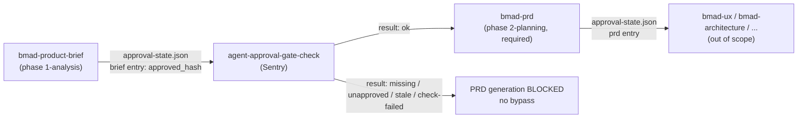

---

## PHASE 1 — Product Brief (`bmad-product-brief`)

Files: `SKILL.md`, `customize.toml` (+ org override `_bmad/custom/bmad-product-brief.toml`), `assets/brief-template.md` (overridden by `_bmad/custom/templates/brief-template.md`), `references/confidence-scoring.md`.

### 1.1 Activation sequence

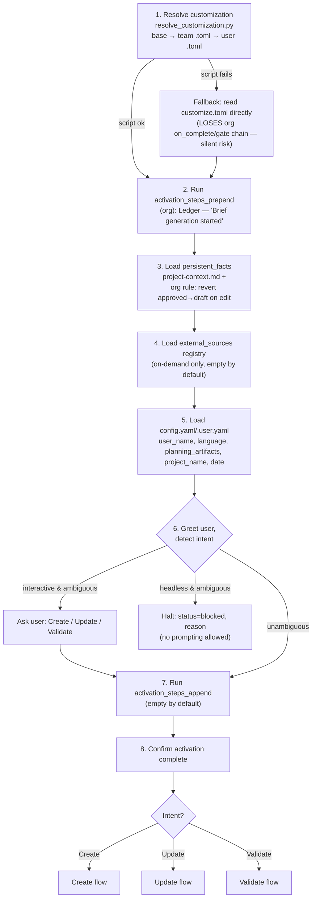

### 1.2 Intent = Create → Discovery → Finalize

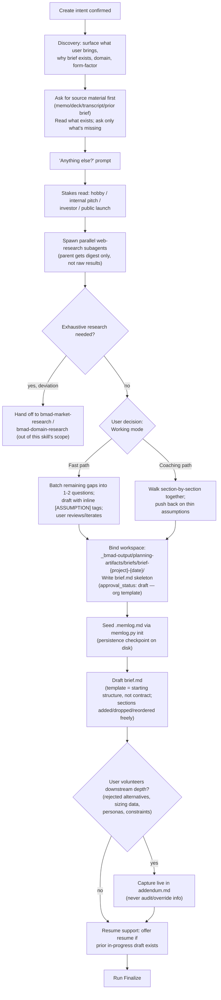

### 1.3 Intent = Update (branches)

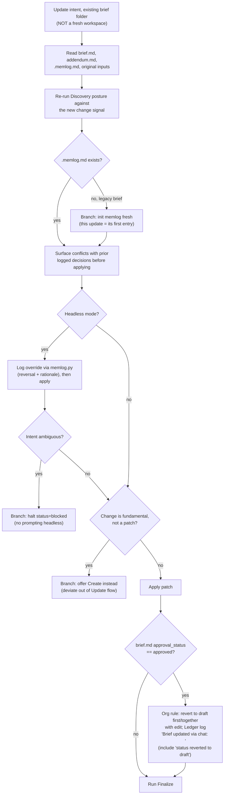

### 1.4 Intent = Validate (standalone, no Finalize)

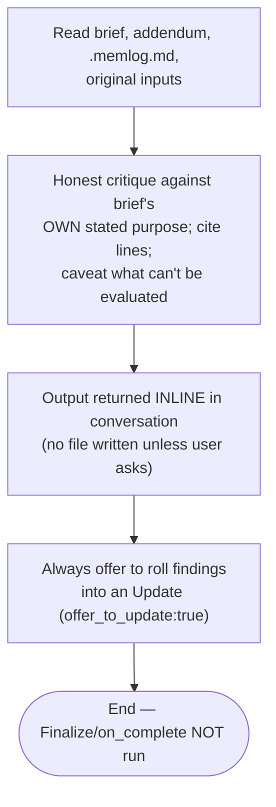

*Note: this is the authoring skill's own lightweight self-critique — distinct from the dedicated adversarial `experion-brief-review` (§4), which always runs all five fixed dimensions.*

### 1.5 Finalize (Create & Update only) → org `on_complete` approval chain

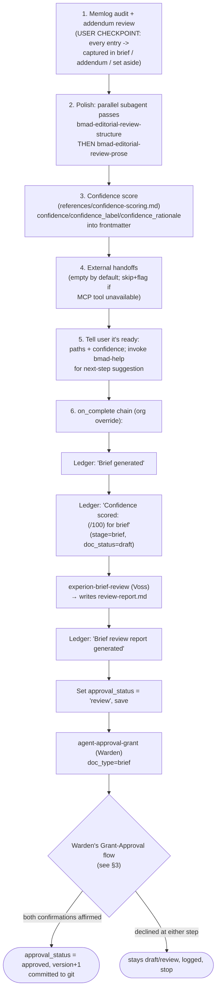

**Brief lifecycle status progression:** `draft` → (Finalize on_complete) → `review` → (Warden double-confirms) → `approved` — or reverts to `draft` on any decline, on any post-approval edit, or on a Sentry staleness hit.

---

## PHASE 2 — PRD (`bmad-prd`)

Files: `SKILL.md`, `customize.toml` (+ org override `_bmad/custom/bmad-prd.toml`), `assets/prd-template.md` (overridden), `assets/prd-validation-checklist.md`, `assets/validation-report-template.html`, `assets/headless-schemas.md`, `references/confidence-scoring.md`, `references/headless.md`, `references/validate.md`.

### 2.1 Activation sequence — the hard Brief→PRD gate

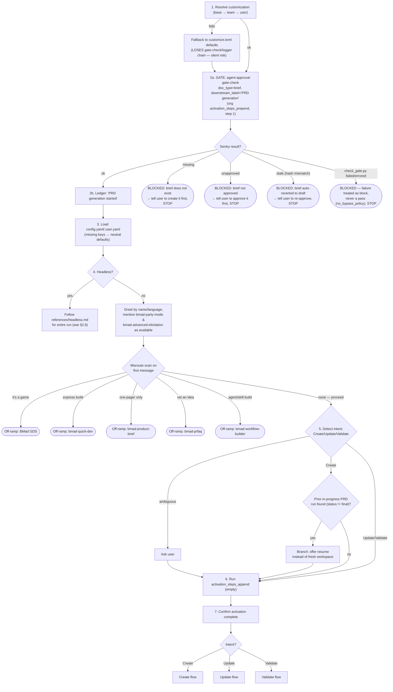

### 2.2 Intent = Create → Discovery

```mermaid
flowchart TD
    PC0["Bind workspace:\n_bmad-output/planning-artifacts/prds/prd-{project}-{date}/\nWrite prd.md skeleton (approval_status: draft)"] --> PC1["Seed .memlog.md via memlog.py init"]
    PC1 --> PC2["Tell user the path"] --> DIS

    DIS["Discovery (fixed order)"] --> DIS1["1. Brain dump: verbal context +\nexisting inputs (explicitly incl.\nproduct brief, research, transcripts,\nprior PRD draft, design docs)"]
    DIS1 --> DIS2["2. Spawn web-research subagents\n(parent gets digest only)"]
    DIS2 --> DIS3{"3. LLM catches itself\nnaming wedges/MVP cuts unprompted?"}
    DIS3 -->|yes| DIS3A["Branch: STOP — hand the pen back\n(elicit, don't direct)"]
    DIS3 -->|no| DIS4
    DIS3A --> DIS4["4. Stakes calibration:\nhobby / internal / launch"]
    DIS4 --> DIS5{"5. User decision:\nWorking mode"}
    DIS5 -->|Fast path| DIS5F["Batched gaps, [ASSUMPTION]-tagged\nfull draft, user reviews"]
    DIS5 -->|Coaching path| DIS5C{"Sub-decision:\nentry point"}
    DIS5C -->|"Vision+Features\n(capability-first)"| DIS5C1
    DIS5C -->|"Journey-led\n(user-first)"| DIS5C1
    DIS5C -->|"'let me suggest'"| DIS5C1
    DIS5C1["Entry point sets section\norder for whole document"]
    DIS5F --> DIS6
    DIS5C1 --> DIS6["6. Concern scan: compliance,\nintegration, SLAs, hardware, API\ncontracts, monetization, data gov.\n(drives Adapt-In Menu clusters)"]
    DIS6 --> DIS7["7. Form-factor probe if not\nalready stated"]
    DIS7 --> DIS8{"8. Warranted?\n(consumer/B2B/meaningful UX)"}
    DIS8 -->|yes| DIS8A["User narrates named-persona\nsession → LLM structures as UJ-N,\nconfirms with user"]
    DIS8 -->|"no (internal tool,\nregulatory-only, hobby, pure tech)"| DIS8B["Downscale/drop User Journeys"]
    DIS8A --> FIN2["Run Finalize"]
    DIS8B --> FIN2
```

### 2.3 Intent = Update / Validate (PRD)

```mermaid
flowchart TD
    subgraph UPDATE["Intent = Update"]
    PU1["Reconcile PRD with change signal;\nsource-extract vs prd/addendum/memlog/inputs"] --> PU2{".memlog.md missing?"}
    PU2 -->|yes| PU2A["Branch: init fresh +\nbootstrap subagent reverse-engineers\na thin log from existing PRD"]
    PU2 -->|no| PU3
    PU2A --> PU3["Surface conflicts with prior\nlogged decisions before applying"]
    PU3 --> PU4{"approval_status\n== approved?"}
    PU4 -->|yes| PU4A["Org rule: revert to draft live,\nLedger 'PRD updated via chat: <summary>'"]
    PU4 -->|no| PUF["Run Finalize"]
    PU4A --> PUF
    end

    subgraph VALIDATE["Intent = Validate (standalone — no Finalize)"]
    PV1["Orient: source-extract vs\nmemlog/inputs/prd/addendum"] --> PV2["Run Reviewer Gate\n(mandatory rubric walker, see §2.4)"]
    PV2 --> PV3["Synthesis pipeline (mandatory,\n'do not skip')"]
    PV3 --> PV3A["Read every review-*.md;\nfill validation-report.html +\nmarkdown twin (grade: Excellent/\nGood/Fair/Poor, mechanical)"]
    PV3A --> PV4{"Headless?"}
    PV4 -->|no| PV4A["Open HTML in default browser"]
    PV4 -->|yes| PV4B["Skip browser-open"]
    PV4A --> PV5["Surface paths; ALWAYS offer\nto roll findings into Update"]
    PV4B --> PV5
    PV5 --> PV6["Re-run overwrites consolidated\nreport in place (review-*.md preserved)"]
    end
```

### 2.4 Reviewer Gate (shared by Validate and Finalize step 3)

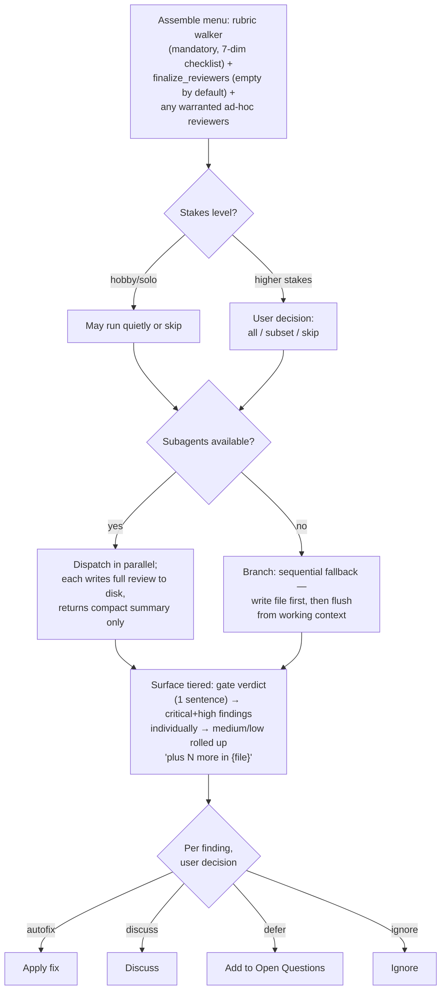

### 2.5 Finalize (PRD) → org `on_complete` approval chain

```mermaid
flowchart TD
    PF1["1. Memlog audit (USER CHECKPOINT):\nevery entry -> captured in PRD /\naddendum / set aside"] --> PF2["2. Input reconciliation:\none subagent per source input vs\nprd+addendum → reconcile-{slug}.md\n(compact gap summary)\nMUST run before polish"]
    PF2 --> PF3["3. Reviewer Gate\n(§2.4) — MUST resolve before polish\n(deviation loop: findings may send\nauthor back to revise content)"]
    PF3 --> PF4["4. Triage open items:\nOpen Questions, [ASSUMPTION],\n[NOTE FOR PM]"]
    PF4 --> PF4A{"Phase-blocker?\n(would break UX/arch/epics)"}
    PF4A -->|yes| PF4B["Resolve one at a time with user"]
    PF4A -->|no| PF4C["Defer with owner + revisit\ncondition, logged via memlog"]
    PF4B --> PF4D{"High phase-blocker\ncount?"}
    PF4D -->|yes| PF4E["Branch: explicit flag to user\n(soft branch, not hard stop)"]
    PF4D -->|no| PF5
    PF4C --> PF5
    PF4E --> PF5["5. Polish: parallel across docs,\nsequential within (structure THEN prose)"]
    PF5 --> PF6["6. Confidence score →\nconfidence/label/rationale frontmatter"]
    PF6 --> PF7["7. External handoffs\n(empty by default)"]
    PF7 --> PF8["8. Close: status=final, updated=date;\nmemlog event 'PRD finalized';\nshare paths + confidence;\nname bmad-ux/bmad-architecture/\nbmad-create-epics-and-stories via bmad-help"]
    PF8 --> OC2["9. on_complete chain (org override):"]
    OC2 --> OC2a["Ledger: 'PRD generated'"]
    OC2a --> OC2b["Ledger: 'Confidence scored: <label>\n(<score>/100) for PRD'\n(stage=prd, doc_status=draft)"]
    OC2b --> OC2c["Set approval_status = 'review', save"]
    OC2c --> OC2d["agent-approval-grant (Warden)\ndoc_type=prd — NO review_skill arg\npassed (asymmetry vs. Brief chain)"]
    OC2d --> APPROVE2{"Warden's Grant-Approval flow\n(§3) — falls back to\nreview_skill_defaults.prd = bmad-prd\n(re-invokes itself, Validate intent,\nif review-rubric.md stale/missing)"}
    APPROVE2 -->|both confirmations affirmed| DONE2(["approval_status = approved,\nversion+1, committed to git"])
    APPROVE2 -->|declined| STAYS2(["stays draft/review, logged, stop"])
```

**PRD lifecycle status progression:** `draft` → (Finalize on_complete) → `review` → (Warden double-confirms, regenerating `review-rubric.md` via self-invocation if stale) → `approved` — or reverts on decline/edit/staleness, identical mechanics to the Brief.

**Structural asymmetry vs. Brief:** the Brief's `on_complete` explicitly invokes `experion-brief-review` and logs a `'Brief review report generated'` step before handing off to Warden. The PRD's `on_complete` does **not** explicitly invoke a review skill — it relies entirely on Warden's own staleness-check fallback (`review_skill_defaults.prd = "bmad-prd"`) to lazily regenerate `review-rubric.md` by calling `bmad-prd` in its own Validate intent.

### 2.6 Headless mode (either phase)

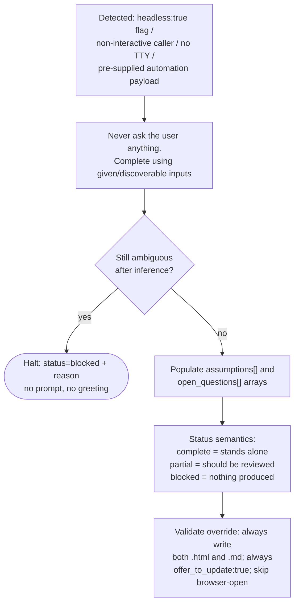

---

## 3. Approval Gate / Grant / Reopen subroutines

These three subroutines are shared machinery invoked by both phases (and, per `approval-state.json`, by architecture downstream).

### 3.1 `agent-approval-gate-check` (Sentry) — hard, unbypassable

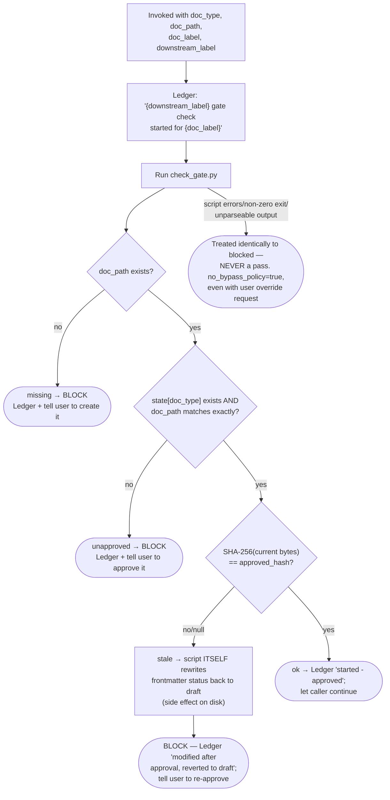

### 3.2 `agent-approval-grant` (Warden) — double confirmation

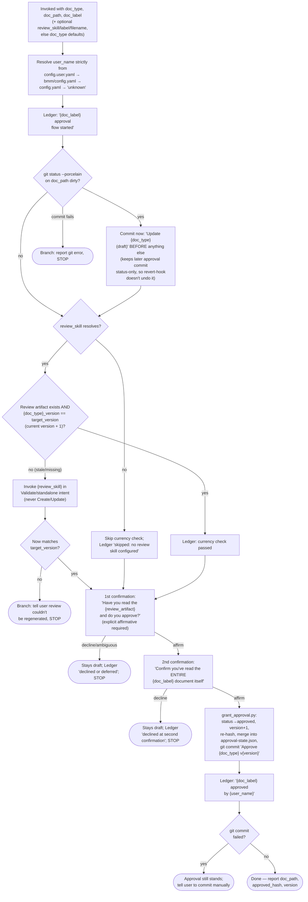

### 3.3 Reopen document (already-approved → back to draft)

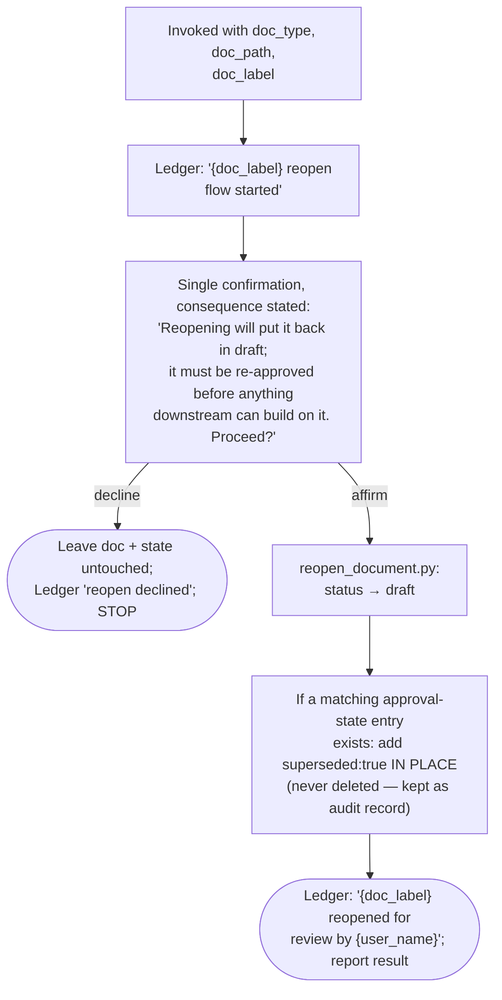

---

## 4. `experion-brief-review` (Voss) — adversarial review

Runs **always all five fixed dimensions**, every run, regardless of how clean the brief looks:

1. Problem statement clarity
2. Defensibility of stated goals
3. Hidden/unstated assumptions
4. Scope-creep risk
5. Gaps in target-user definition

Each finding cites a line/section (or its absence) and carries severity `critical` / `moderate` / `minor`. A clean dimension is explicitly marked "clean" — never silently skipped.

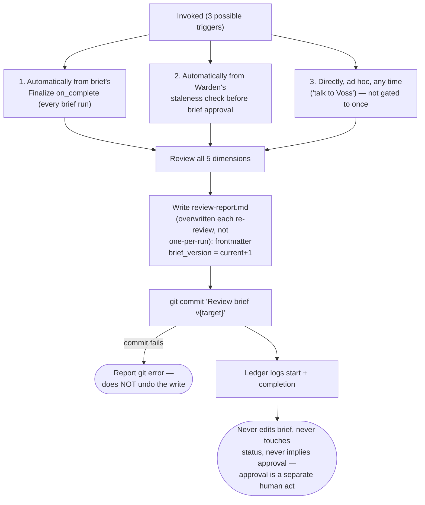

**Mandatory in practice** for brief→approval: hard-wired into both `bmad-product-brief`'s `on_complete` and Warden's staleness-fallback for `doc_type=brief`. Not listed in `bmad-help.csv`, so it's invisible to a user browsing that catalog — it only surfaces as an automatic side effect.

---

## 5. `bmad-advanced-elicitation` — optional deeper-critique loop

Entirely **optional, user-triggered**. Both `bmad-product-brief` and `bmad-prd` merely mention it's available during their opening greeting; neither invokes it automatically at any fixed step.

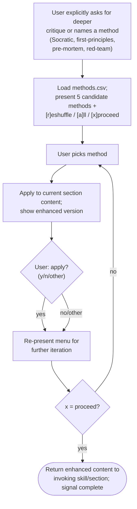

---

## 6. Customization layer (`bmad-customize`) — what's actually overridden here

`bmad-customize` is a meta-skill that authors TOML overrides under `_bmad/custom/` for any skill's exposed `[workflow]`/`[agent]` surface. It does not itself customize Brief/PRD — it is the tool used to *create* the overrides below, which already exist and materially change the stock flow:

| Override file | Effect |
|---|---|
| `_bmad/custom/bmad-product-brief.toml` | Org `brief-template.md` (frontmatter uses `approval_status`, not `status`); appends live "revert approved→draft on edit" fact; appends Ledger call to `activation_steps_prepend`; **replaces** `on_complete` with the 6-step review→approval chain (§1.5). |
| `_bmad/custom/bmad-prd.toml` | Org `prd-template.md` + org validation checklist; same live revert-on-edit fact; **replaces** `activation_steps_prepend` with the Sentry gate + Ledger start-log (the literal Brief→PRD hard gate — not present in stock defaults); **replaces** `on_complete` with the 4-step chain (no explicit review-skill call, relies on Warden fallback). |
| `_bmad/custom/agent-approval-gate-check.toml` | `status_field = "approval_status"` (overrides stock `"status"`). |
| `_bmad/custom/agent-approval-grant.toml` | `status_field = "approval_status"`; adds `review_skill_defaults` / `review_artifact_label_defaults` / `review_artifact_filename_defaults` tables per `doc_type` — entirely org-added, not in stock `customize.toml`. |
| `_bmad/custom/approval-state.json` | Live data (not a template) — shared hand-off state across brief/prd/architecture. |

**`.agents/skills/` vs `.claude/skills/` divergence:** `bmad-product-brief` and `bmad-prd` themselves are byte-identical across both trees. The real divergence is that `.agents/skills/` is **missing six skill directories entirely** that exist under `.claude/skills/`: `agent-approval-gate-check`, `agent-approval-grant`, `agent-project-logger`, `confidence-scorer`, `experion-brief-review`, `prompt-gateway-guard`. Any harness that resolves skills from `.agents/skills/` would run Brief/PRD's own logic identically, but every gate-check, approval-grant/reopen, adversarial review, and logging step referenced by the org `on_complete`/`activation_steps_prepend` chains would have no skill to resolve to.

---

## 7. Status-field lifecycle (org-customized reality)

| Stage | `approval_status` | Set by | Trigger |
|---|---|---|---|
| Workspace bound (Create intent) | `draft` | authoring skill | workspace bind |
| Content edited after approval, mid-conversation | `draft` (reverted) | authoring skill, live | org persistent_fact |
| Finalize `on_complete` completes | `review` | authoring skill's on_complete | after Voss (brief) / lazily via Warden fallback (PRD) |
| Gate check finds stale hash | `draft` (reverted) | `check_gate.py` itself | Sentry invocation |
| Both Warden confirmations affirmed | `approved`, version +1 | `grant_approval.py` | Warden |
| User reopens an approved doc | `draft`, state entry flagged `superseded:true` (kept) | `reopen_document.py` | Warden (Reopen) |

## 8. Exact Brief → PRD hand-off condition

PRD generation cannot begin Discovery/drafting until `_bmad/custom/bmad-prd.toml`'s `activation_steps_prepend` step 1 (Sentry, `doc_type='brief'`) returns `{"result":"ok"}`, requiring **all** of:

1. `_bmad/custom/approval-state.json` has a `brief` entry.
2. That entry's `doc_path` resolves to the exact same absolute path as the brief being handed to the PRD skill.
3. A fresh SHA-256 of that brief file's current bytes equals the recorded `approved_hash`.

Any mismatch reverts the brief to `draft` (if stale) and hard-blocks PRD generation — `no_bypass_policy = true`, no exceptions, even on script failure.
