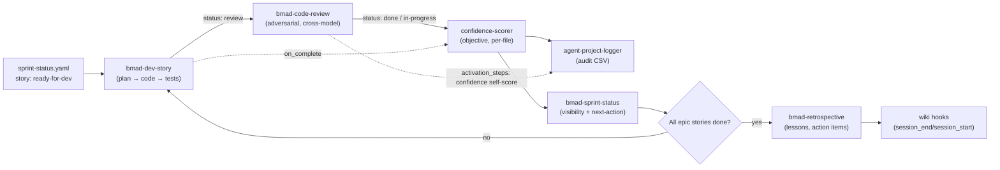
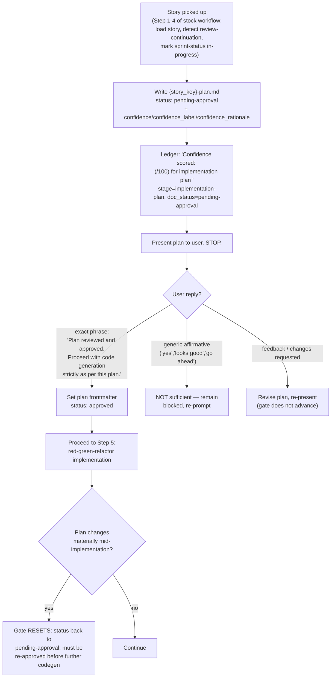
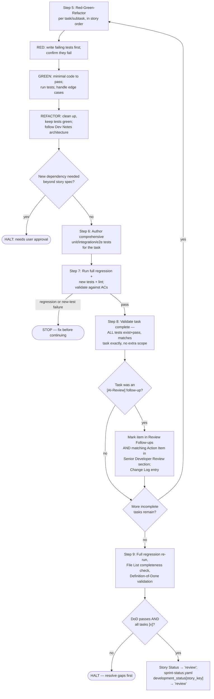
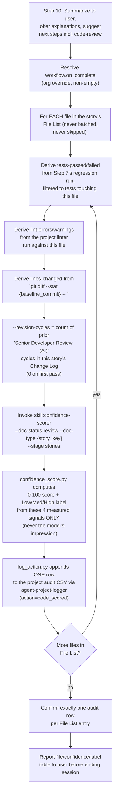
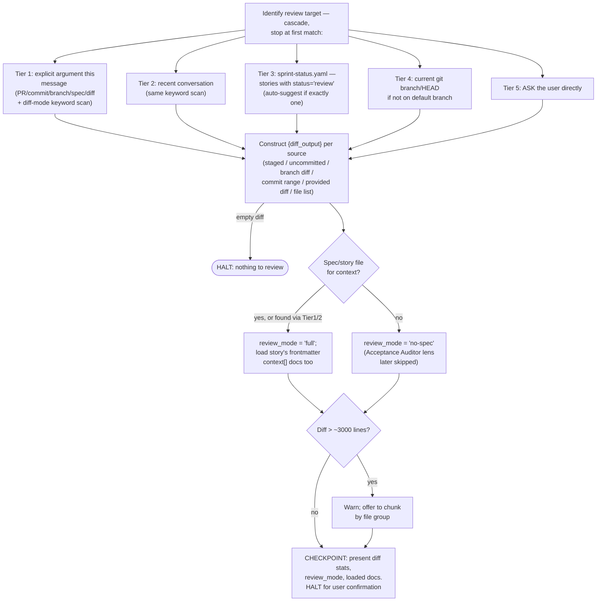
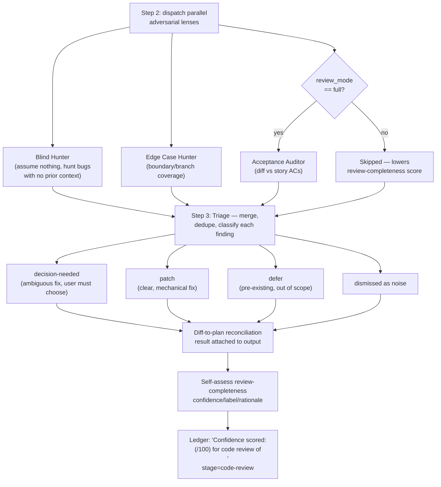
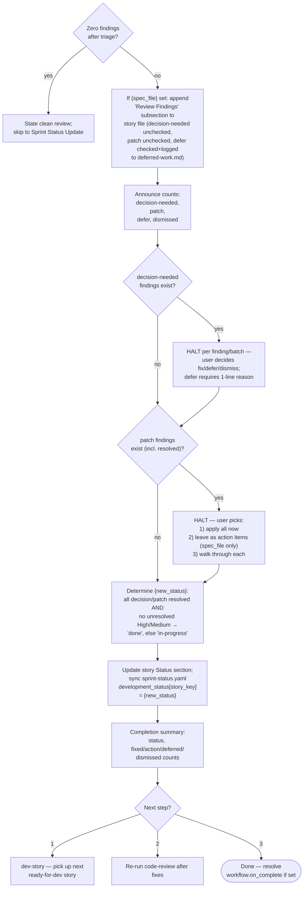
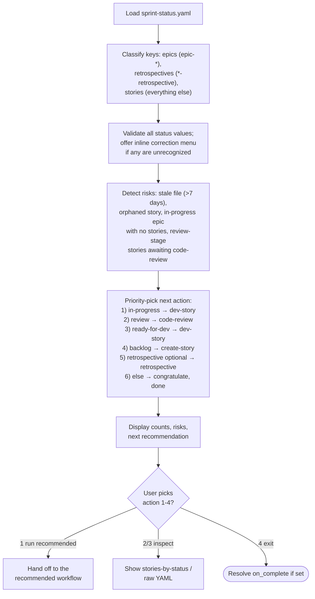
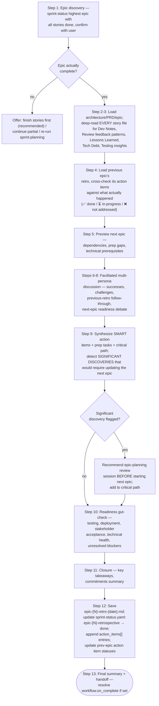
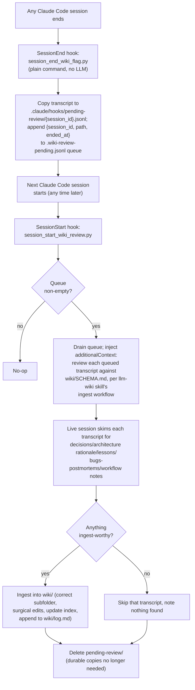

# BMAD Workflow: Story Dev → Code Review → Confidence Scoring → Sprint/Retro (Detailed Flow)

This document picks up where [`docs/WORKFLOW.md`](WORKFLOW.md) leaves off. That document maps Brief → PRD.
This one maps everything **after a story is picked up for implementation through what happens once
source code has been generated** — dev execution, the mandatory plan-approval gate, code review,
objective confidence scoring, sprint-status sync, and epic retrospectives — as actually wired in this
repo (stock BMad skills + the Experion/org customization layer on top).

Sources: `.claude/skills/bmad-dev-story/`, `.claude/skills/bmad-code-review/`, `.claude/skills/confidence-scorer/`,
`.claude/skills/agent-project-logger/`, `.claude/skills/bmad-sprint-status/`, `.claude/skills/bmad-retrospective/`,
`_bmad/custom/bmad-dev-story.toml`, `_bmad/custom/bmad-code-review.toml`, `.claude/hooks/session_end_wiki_flag.py`,
`.claude/hooks/session_start_wiki_review.py`.

> **Persona note:** Ledger = `agent-project-logger`, Audit = `confidence-scorer`, Amelia = the Dev agent
> persona used inside `bmad-dev-story` / `bmad-retrospective`.

---

## 0. Where this picks up

By the time a story reaches `bmad-dev-story`, `sprint-status.yaml` already has it as `ready-for-dev`
(produced upstream by `bmad-create-epics-and-stories` / `bmad-sprint-planning` / `bmad-create-story` —
out of scope here). This document starts at story pickup and ends at epic retrospective.

---

## PHASE 3 — Dev Story (`bmad-dev-story`)

Files: `SKILL.md`, `customize.toml`, org override `_bmad/custom/bmad-dev-story.toml`.

### 3.1 Org customization layered on top of stock dev-story

The stock skill has empty `activation_steps_prepend/append` and empty `on_complete`. The org override
adds four `persistent_facts` and a non-empty `on_complete` — this is where this project's process
diverges most sharply from stock BMAD:

| Org addition | Effect |
|---|---|
| Fact 1 | Always load `.ai-context.md`, `.ai-context-security.md`, `.ai-context-dependencies.md`; conditionally load `.ai-context-api.md` / `.ai-context-errors.md` / `.ai-context-idea-generation.md` depending on what the story touches. |
| Fact 2 — **Plan-first hard gate** | Before any code generation, write `{story-dir}/{story_key}-plan.md` (frontmatter: `status: pending-approval`, confidence fields) covering scope, impacted files, design, data model, API changes, error handling, security, performance, test strategy, risks, context files consulted, rationale. Present it and **STOP**. |
| Fact 3 — **Plan confidence** | Self-assess `confidence`/`confidence_label`/`confidence_rationale` for the *plan* (not the code) before presenting it; log via `agent-project-logger` immediately after writing the plan file. |
| Fact 4 — **Scope lock** | Generated code must stay strictly inside the approved plan's stated files/modules/schemas; anything else requires stopping to ask first. |
| `on_complete` | Runs `confidence-scorer` once per file in the story's File List — see §3.4. |

### 3.2 Plan-approval gate (blocks Step 5 of the stock workflow)

### 3.3 Implementation loop (stock Steps 5–9, scope-locked to the approved plan)

**3 consecutive implementation failures** or **missing required configuration** are separate explicit
HALT conditions at any point in Step 5.

### 3.4 Completion → confidence scoring on generated code (`on_complete`)

This is the direct answer to "what happens after the source code is generated": once Status = `review`
and the File List is final, the org `on_complete` chain fires automatically, before the session ends.

**Key property:** this scores the *code that was actually generated* — a different, later measurement
than the plan-confidence score in §3.2, which only rated the *plan* before any code existed. Both are
logged, distinguishable by `stage` (`implementation-plan` vs `stories`) in the same audit log.

---

## PHASE 4 — Code Review (`bmad-code-review`)

Files: `SKILL.md` + `steps/step-01..04-*.md`, org override `_bmad/custom/bmad-code-review.toml`.
The dev-story completion message explicitly recommends running this **in a different LLM session**
than the one that wrote the code, to avoid self-review bias — the org override makes this a hard
persistent fact, not just a tip.

### 4.1 Step 1 — Gather context (read-only)

### 4.2 Steps 2–3 — Parallel adversarial review + triage (org confidence layer)

Step 2 (`step-02-review.md`) fans out to parallel review lenses — **Blind Hunter**, **Edge Case
Hunter**, and (only in `review_mode='full'`) **Acceptance Auditor** against the spec's ACs — each an
independent adversarial pass over the same diff. Step 3 (`step-03-triage.md`) merges their raw findings
into one triaged list.

The org override adds three persistent facts layered over the stock two-step review:

1. Always load the same `.ai-context*.md` files as dev-story (mirrors the code-generation context).
2. **Fresh-session requirement** — if this session also generated the code under review, say so and
   recommend restarting in a fresh session (anti self-review-bias).
3. **Fixed severity vocabulary** — CRITICAL (security/data-loss, escalate to Tech Lead) / HIGH (plan
   deviation, unhandled exception, perf risk) / MEDIUM (standards, missing log, naming) / LOW (style).
4. **Diff-to-plan reconciliation**, mandatory every run: `git diff` file list vs. the plan's/story's
   stated Impacted Modules & Files — flag files present in the diff but not in the plan, and files in
   the plan but absent from the diff (signals incomplete implementation).
5. **Review-completeness confidence score** (distinct from code-quality findings) — self-assessed at
   Step 4, lowered for any failed/skipped reviewer lens, `no-spec` mode, a diff the user chose to chunk,
   or any best-effort/uncertain finding. Logged via `agent-project-logger` the same way as dev-story's
   plan/code scores, with `stage='code-review'`.

### 4.3 Step 4 — Present, resolve, and sync status

**Outcome that matters most:** a story only reaches `done` in `sprint-status.yaml` via this step — never
directly from `bmad-dev-story`, which only ever sets `review`. Code review is the sole gate between
"code exists and its own author calls it finished" and "status: done."

---

## PHASE 5 — Sprint Status (`bmad-sprint-status`)

Passive dashboard, not a gate — reads `sprint-status.yaml`, never blocks progress. Runs any time
(commonly after dev-story or code-review) to answer "what's next."

---

## PHASE 6 — Retrospective (`bmad-retrospective`)

Triggered once every story in an epic is `done` (per sprint-status's own recommendation, priority 5).
Runs as a "party mode" multi-persona facilitated session (Amelia facilitates; Alice/Charlie/Dana/Elena
are fixed supporting personas), always in two parts: **Epic Review** then **Next Epic Preparation**.

---

## PHASE 7 — Cross-cutting: audit log + LLM Wiki capture

These two mechanisms run independently of any single phase above, but are triggered by everything in
Phases 3–6.

### 7.1 `agent-project-logger` (Ledger) — the shared audit trail

Every confidence score in Phases 3–4 (plan confidence, code confidence per file, review-completeness
confidence) lands here as one CSV row via `log_action.py` — append-only, one action in / one row out,
never batched or reordered. This is the single source of truth Audit (`confidence-scorer`) reads and
writes against; there is no parallel score store.

### 7.2 LLM Wiki capture (session hooks, independent of BMAD skills entirely)

This means implementation sessions (dev-story, code-review, retrospective included) are themselves a
source the wiki draws from on a lag of one session boundary — decisions or lessons surfaced during a
dev-story or retro session, even if never manually written to the wiki, get a second chance to be
captured automatically the next time any Claude Code session starts in this repo.

---

## 8. Full status-field lifecycle across Phases 3–6

| Stage | `sprint-status.yaml` story status | Set by | Trigger |
|---|---|---|---|
| Story queued | `ready-for-dev` | upstream (create-story / sprint-planning) | out of scope here |
| Story picked up | `in-progress` | `bmad-dev-story` Step 4 | first task started or review-continuation resumed |
| All tasks complete, DoD passed | `review` | `bmad-dev-story` Step 9 | never set to `done` directly |
| Code review resolves cleanly | `done` | `bmad-code-review` Step 4 | all decision/patch resolved, no unresolved High/Medium |
| Code review leaves open items | `in-progress` | `bmad-code-review` Step 4 | patch findings left as action items, or unresolved issues remain |
| Epic fully done | `epic-{N}-retrospective`: `optional` → `done` | `bmad-retrospective` Step 12 | run once all stories in the epic are `done` |

Confidence scores (plan / code / review-completeness) are a **parallel, additive** audit trail via
`agent-project-logger` — they never gate the status transitions above; the plan-approval exact-phrase
gate (§3.2) is the only hard human-in-the-loop block in this half of the pipeline.

---

## 9. Answer in one paragraph: "what happens after the source code is generated?"

Once `bmad-dev-story` finishes red-green-refactor for the last task and Definition-of-Done passes, the
story's Status flips to `review` (never straight to `done`) and, still inside the same dev-story run,
the org `on_complete` chain invokes `confidence-scorer` once per changed file — computing an objective
0–100 score from measured test/lint/diff/revision signals and logging one audit row per file via
`agent-project-logger`. The user is then pointed at `bmad-code-review`, which should run in a **separate
session** to avoid self-review bias: it fans out adversarial review lenses (Blind Hunter, Edge Case
Hunter, and — when a spec is available — Acceptance Auditor), reconciles the diff against the approved
plan's stated file scope, triages findings into decision-needed/patch/defer/dismissed, self-scores its
own *review completeness* (a second, distinct confidence number, also logged), and only then decides
whether the story becomes `done` or bounces back to `in-progress`. `bmad-sprint-status` surfaces this
state and recommends the next action; once every story in an epic reaches `done`, `bmad-retrospective`
runs a facilitated multi-persona session that mines every story's Dev Notes/Review/Lessons sections,
checks follow-through on the previous epic's action items, flags any discovery significant enough to
require updating the next epic's plan, and records new action items back into `sprint-status.yaml`.
Independently of all of this, whenever any Claude Code session in this repo ends, its transcript is
queued for review and surfaced to the very next session's start, which is asked to mine it for anything
wiki-worthy (decisions, lessons, bugs) and file it into `wiki/` — so implementation knowledge from dev,
review, and retro sessions has a standing second chance to become durable project memory even if never
manually captured.
