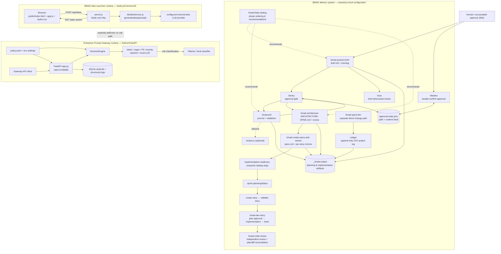
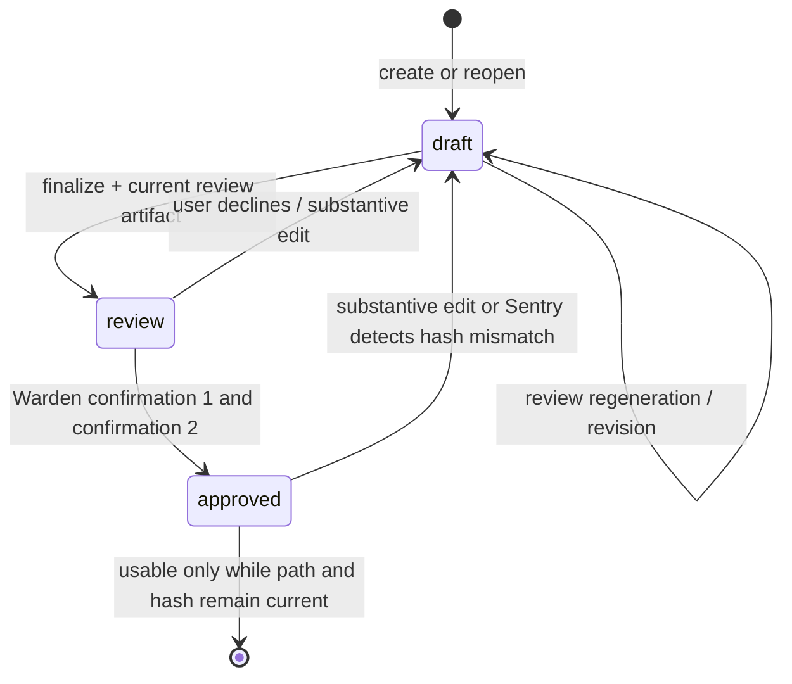
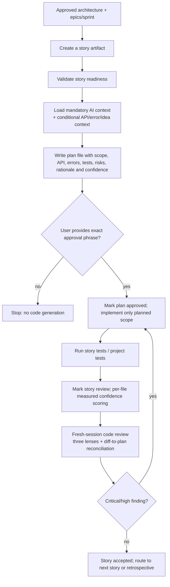
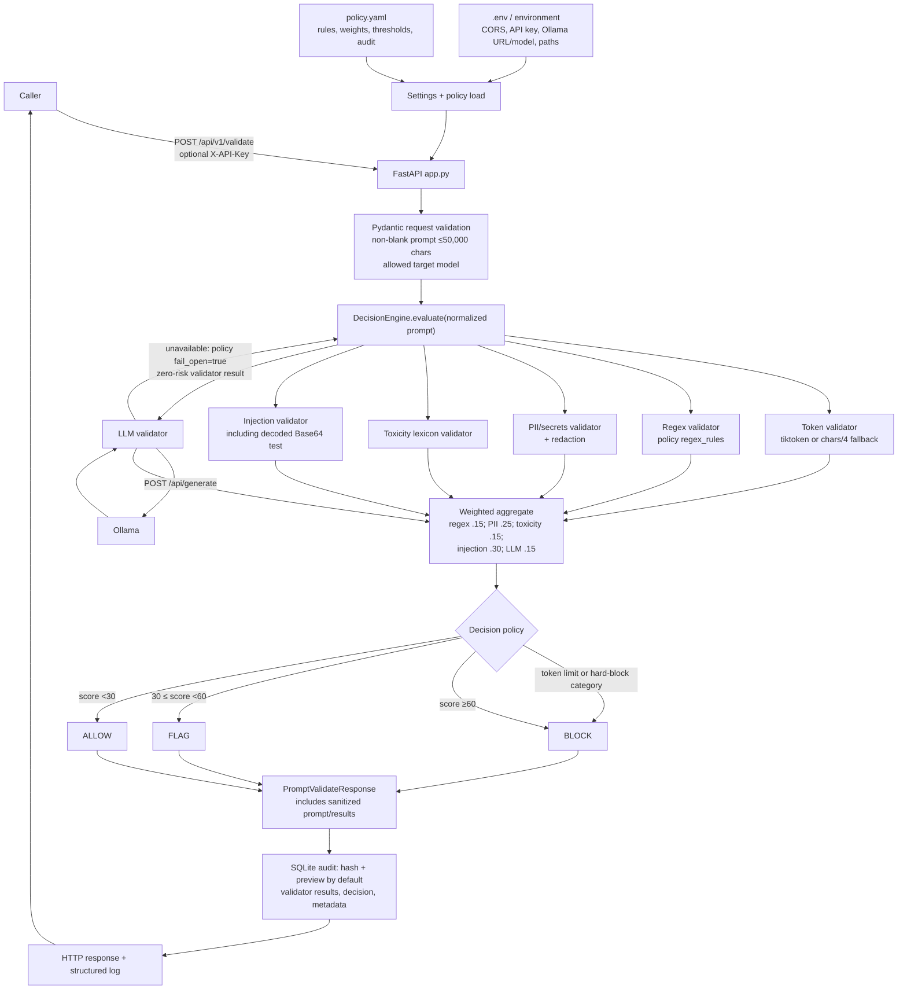

# Implemented System Workflow

> **Scope and evidence.** This is a code-and-configuration-derived map of what is present in this repository as of 2026-08-10. It covers three deliberately separate surfaces: the BMAD delivery workflow, the BMAD Idea Launcher runtime, and the Prompt Gateway runtime. The Idea Launcher has **no runtime integration** with `PromptGateway/`; its architecture and `.ai-context.md` explicitly defer it.
>
> **Diagram source.** The Mermaid blocks in this document are the editable diagram source. Render them in a Mermaid-capable Markdown viewer or paste the first block into Mermaid Live Editor.

## System landscape and boundaries



## 1. BMAD delivery workflow

### 1.1 Workflow control plane

`_bmad/_config/bmad-help.csv` defines the recommended order. `preceded-by` relationships are advisory; the approval gate configuration supplies the hard stop for Brief → PRD and PRD → Architecture. Artifact paths are configured in `_bmad/bmm/config.yaml`:

- Planning: `_bmad-output/planning-artifacts`
- Implementation: `_bmad-output/implementation-artifacts`
- Project log: `_bmad-output/bmad-idea-launcher-project-log.csv`
- Project identity: `bmad-idea-launcher`; interaction/document language: English.

```mermaid
flowchart LR
  I["Idea / source materials"] --> B["Product Brief\nCreate / Update / Validate"]
  B -->|finalize| BR["Review report\nVoss: five fixed dimensions"]
  BR --> BA["approval_status: review"]
  BA --> W1{"Warden: two explicit\nhuman confirmations?"}
  W1 -->|yes| BS["approved; version incremented;\npath + hash stored"]
  W1 -->|no| BD["draft/review; stop"]
  BS --> G1{"Sentry: exact path approved\nand current hash?"}
  G1 -->|yes| P["PRD\nCreate / Update / Validate"]
  G1 -->|missing / unapproved / stale| BX["blocked; stale document\nauto-reverts to draft"]
  P --> PA["Reviewer gate + validation artifact\nthen Warden double confirmation"]
  PA --> G2{"Sentry: approved PRD\nand current hash?"}
  G2 -->|yes| A["Architecture spine\nreview gate + Warden"]
  G2 -->|no| PX["architecture blocked"]
  A --> E["Epics & stories\ncanonical epics.md + mirrors"]
  E --> R["Implementation readiness"] --> SP["Sprint planning"]
  SP --> CS["Create story"] --> VS["Validate story"] --> DS["Dev story"] --> CR["Code review"]
  CR -->|findings| DS
  CR -->|accepted| NX["next story / retrospective"]
```



### 1.2 Cross-cutting customizations actually installed

| Concern | Implemented behavior |
| --- | --- |
| Customization resolution | BMAD merges base `customize.toml`, team `_bmad/custom/<skill>.toml`, then optional user TOML via `resolve_customization.py`. Workflow hooks and persistent facts come from that result. |
| Approval representation | `_bmad/custom/approval-state.json` records approved document path and SHA-256 hash for `brief`, `prd`, and `architecture`. Current state contains all three types. |
| Sentry gate | Before PRD generation, checks the approved brief; before architecture, checks the approved PRD. Exact path and unchanged hash are mandatory. Missing, unapproved, stale, or script-error outcomes block. A stale source document is changed to `approval_status: draft`. |
| Warden approval | Ensures current review artifact, optionally regenerates it, asks two separate explicit confirmations, then atomically sets `approval_status: approved`, increments version, commits, and updates approval state. Reopen requires explicit confirmation and preserves superseded history. Defaults: Brief → Voss; PRD → `bmad-prd` Validate; Architecture → `bmad-architecture` Validate. |
| Ledger | Appends one event per action to the CSV log; status/confidence/document path columns are used by later customizations. |
| Voss | Brief-only adversarial review against problem clarity, goals, assumptions, scope creep, and target-user gaps. Writes `review-report.md`; never approves or edits the brief. |
| Edit invalidation | Substantive Brief, PRD, or Architecture edits after approval must first revert approval to draft and immediately create a Ledger event. |
| Confidence | Brief, PRD, Architecture, UX, Epics, implementation plans, completed-code files, and code reviews have configured confidence reporting. |
| Story mirrors | `epics.md` remains canonical; every approved story is also mirrored under `planning-artifacts/epics/epic-{n}-{slug}/story-{epic}.{story}-{slug}.md`. |
| Story context | `bmad-create-story`, `bmad-dev-story`, and code review load `.ai-context.md`, security, and dependency context; API/error/idea-generation context is conditional on touched scope. |
| Dev-plan hard gate | `bmad-dev-story` must write `{story_key}-plan.md`, report confidence, and stop. Code work starts only after the exact required user sentence approving the plan. Material plan changes reset the gate. |
| Review hardening | `bmad-code-review` must be fresh-session independent from implementation, use fixed severities, reconcile `git diff` against planned files, and report review-coverage confidence. |
| Code confidence | `bmad-dev-story`/`bmad-quick-dev` invoke `confidence-scorer` per changed file from measured tests, lint, diff size, and review cycles; each result becomes a Ledger row. |

### 1.3 Document lifecycle state machine



### 1.4 Implementation path detail



## 2. BMAD Idea Launcher runtime (implemented)

This is a separate Node.js application at repository root. Its current implementation is a layered, state-free server: static browser assets → `server.js` HTTP handler → `lib/ideaService.js` → configurable external LLM provider. It uses Node core `http`, CommonJS, and `node --test`.

```mermaid
sequenceDiagram
  actor U as User
  participant B as Browser/public/app.js
  participant S as server.js
  participant I as lib/ideaService.js
  participant L as External idea LLM

  U->>B: type prompt; click Generate
  alt blank client prompt
    B-->>U: inline validation error; no request
  else non-blank prompt
    B->>B: clear error; disable button
    B->>S: POST /api/ideas {prompt}
    alt invalid JSON / invalid or >2000-char prompt
      S-->>B: 400 {error}
    else valid prompt
      S->>I: generateIdeas(prompt)
      I->>L: provider HTTP call (fresh per request)
      alt success: exactly three valid ideas
        L-->>I: provider JSON
        I-->>S: [{title, description}] x3
        S-->>B: 200 {ideas}
        B->>B: escape HTML; render 3 cards
      else adapter timeout
        I-->>S: throw code TIMEOUT
        S-->>B: 504 {error}
      else connection/provider failure
        I-->>S: throw code NETWORK
        S-->>B: 502 {error}
      else malformed/unknown adapter failure
        I-->>S: throw code MALFORMED or other
        S-->>B: 500 {error}
      end
    end
    B->>B: re-enable button; show result or inline error
  end
```

Implemented constraints and behavior:

- `server.js` serves `GET /`, `/styles.css`, `/app.js`; other paths are `404 {error}`.
- `POST /api/ideas` parses JSON, trims `prompt`, rejects absent/non-string/blank prompts and prompts longer than 2,000 characters with 400, then maps `TIMEOUT` → 504, `NETWORK` → 502, and `MALFORMED`/other errors → 500.
- `ideaService.js` reads its provider configuration at module load, creates one `AbortController` per call, calls a configured provider URL with bearer authentication, parses `choices[0].message.content`, and only resolves after validating exactly three non-empty `{title, description}` entries. It does not cache.
- Browser JavaScript blocks blank submissions, disables its button for the request, retains the field value on errors, escapes returned title/description, and currently renders cards. The approved planning artifacts specify client state/favorites, but the checked-in `public/app.js` does not yet contain a state object or favorite controls; those are planned Story 2 work, not current runtime behavior.
- The checked-in server does not implement the 10 KB raw-body cap that the approved architecture/epics prescribe. This diagram records the implemented handler; the cap belongs to the planned contract.

## 3. Prompt Gateway runtime (implemented, independent)



Gateway decision rules from `policy.yaml`:

- Hard-block categories are `secret_leak`, `critical_injection`, and `credit_card`, regardless of weighted total.
- Otherwise scores below 30 allow, 30–59.99 flag, and 60+ block.
- Token-limit failure blocks regardless of weighted score.
- The only weighted validators are regex, PII, toxicity, injection, and local LLM; token validation is a separate hard limit/warning check.
- Audit storage defaults to a hash plus 120-character preview, not raw prompts. The declared 90-day retention setting is configuration only; no scheduled purge job is implemented.
- `GET /health`, `/api/v1/policy`, `/api/v1/audit/{request_id}`, and `/api/v1/stats` provide operations/query surfaces. `/api/v1/*` can be protected with `REQUIRE_API_KEY`.
- Docker Compose starts `prompt-gateway` (port 8000) and Ollama (port 11434), mounts policy read-only, and persists logs/audit DB on the host.

## 4. Deliberate non-integration

There is no code path from the Idea Launcher to Prompt Gateway. `lib/ideaService.js` directly calls its configured idea provider; `PromptGateway/` exposes a different FastAPI API and is documented as separate prompt-hygiene tooling. Connecting them would require a new architecture decision, API/client mapping, authentication and failure-policy decisions, plus revised tests; it must not be inferred from their co-location.

## 5. Evidence consulted

- Root runtime: `server.js`, `lib/ideaService.js`, `public/`, `test/`, `.ai-context*.md`.
- Gateway runtime: `PromptGateway/app.py`, `config.py`, `policy.yaml`, validators, utilities, Docker assets, tests, and README.
- BMAD configuration: `_bmad/_config/bmad-help.csv`, `_bmad/bmm/config.yaml`, `_bmad/custom/*.toml`, custom skills under `skills/`, planning artifacts, and the Ledger CSV.

For regeneration, use [the companion prompt](implemented-system-workflow-regeneration-prompt.md).
